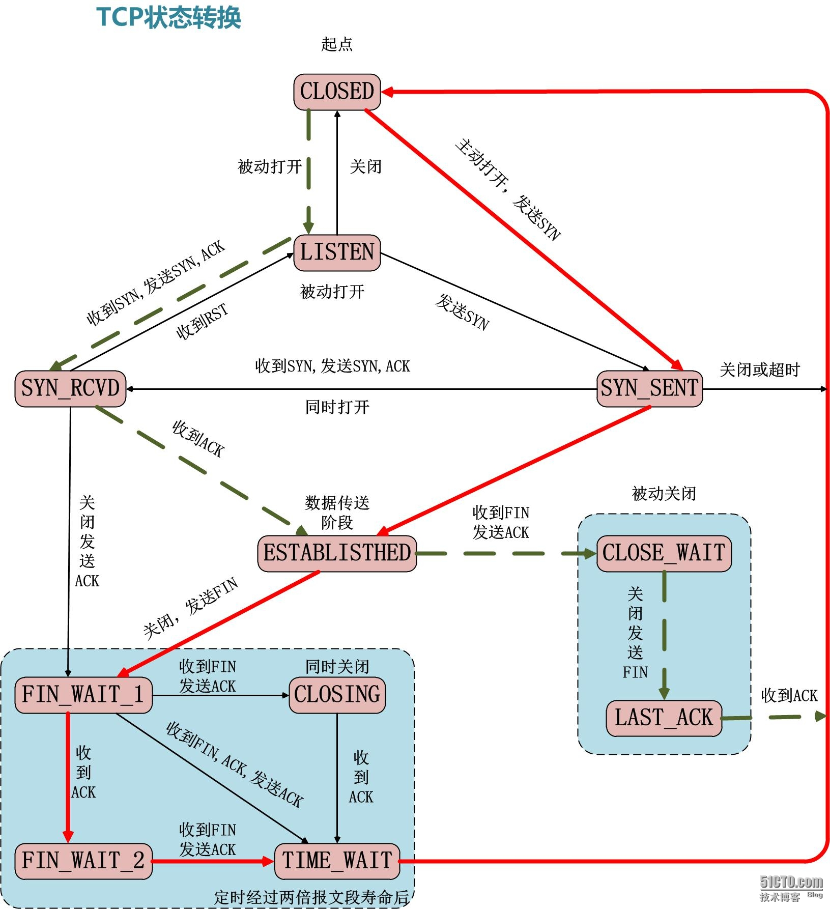

状态说明：

**CLOSED**: 表示初始状态

**LISTEN**: 表示服务器端的某个SOCKET处于监听状态，可以接受连接了

**SYN_RCVD**: 表示接受到了SYN报文，在正常情况下，这个状态是服务器SOCKET建立TCP连接的三次握手会话过程中的一个中间状态，很短暂，基本上用netstat很难看到这个状态，除非写一个客户端测试程序，故意将三次TCP握手过程中最后一个ACK报文不发送因此这个状态时，当收到客户端的ACK报文后，它会进入到ESTABLISHED状态

**ESTABLISHED**: 表示连接已经建立了

**FIN_WAIT_1**: 1和2真正的含义是表示等待对方的FIN报文，而这两种状态的区别是：FIN_WAIT_1状态实际上是当SOCKET在ESTABLISHE态时，它想主动关闭连接，向对方发送了FIN报文，此时该SOCKET即进入到FIN_WATI_1状态，而当对方回应ACK报文后则进入到FIN_WAIT_2状态，当然在实际正常情况下，无论对方何种情况下，都应该马上回应ACK报文，所以FIN_WAIT_1状态比较难见，而FIN_WAIT_2状态还有时常可以用netstat看到

**FIN_WAIT_2**：FIN_WAIT_2状态下的SOCKET，表示半连接，也即有一方要求close连接，但另外还告诉对方，我暂时还有点数据要传送给你稍后再关闭连接

**TIME_WAIT**: 表示收到了对方的FIN报文，并发送出ACK报文，就等2MSL后即可回到CLOSED可用状态了，如果FIN_WAID_1状态下，收到了对方同时带FIN标志和ACK标志的报文时，可以直接进入到TIME_WAIT状态，而无须经过FIN_WAIT_2状态

**CLOSING**: 这种状态比较特殊，实际情况中很少见。正常情况下，发送FIN报文后，按理来说应该先收到（或同时收到）到方的ACK报文再收到对方的FIN报文，但是CLOSING状态表示你发送FIN报文后，并没有收到的收到对方的ACK报文，反而却也收到了对方的FIN报文。发生的原因：如果双方几乎在同时close一个SOCKET的话，那么就出现了双方同时发送FIN报文的情况，也即会出现CLOSING状态，表示双方都正在关闭SOCKET连接

**CLOSE_WAIT**: 表示等待关闭，当对方close一个SOCKET后发送FIN报文给自己，系统毫无疑问也会回应一个ACK报文给对方，此时则进入到CLOSE_WAIT状态，接下来，实际上真正要考虑的是看你是否还有数据发送给对方，如果没有的各话，那么你也可以close这个SOCKET，发送FIN报文给对方，也即关闭连接，所以你有CLOSE_WAIT状态下，需要完成的事情是等待你去关闭连接

**LAST_ACK**: 表示被动关闭一方在发送FIN报文后，最后等待对方的ACK报文，当收到ACK报文后，也即可以进入到CLOSED可用状态了