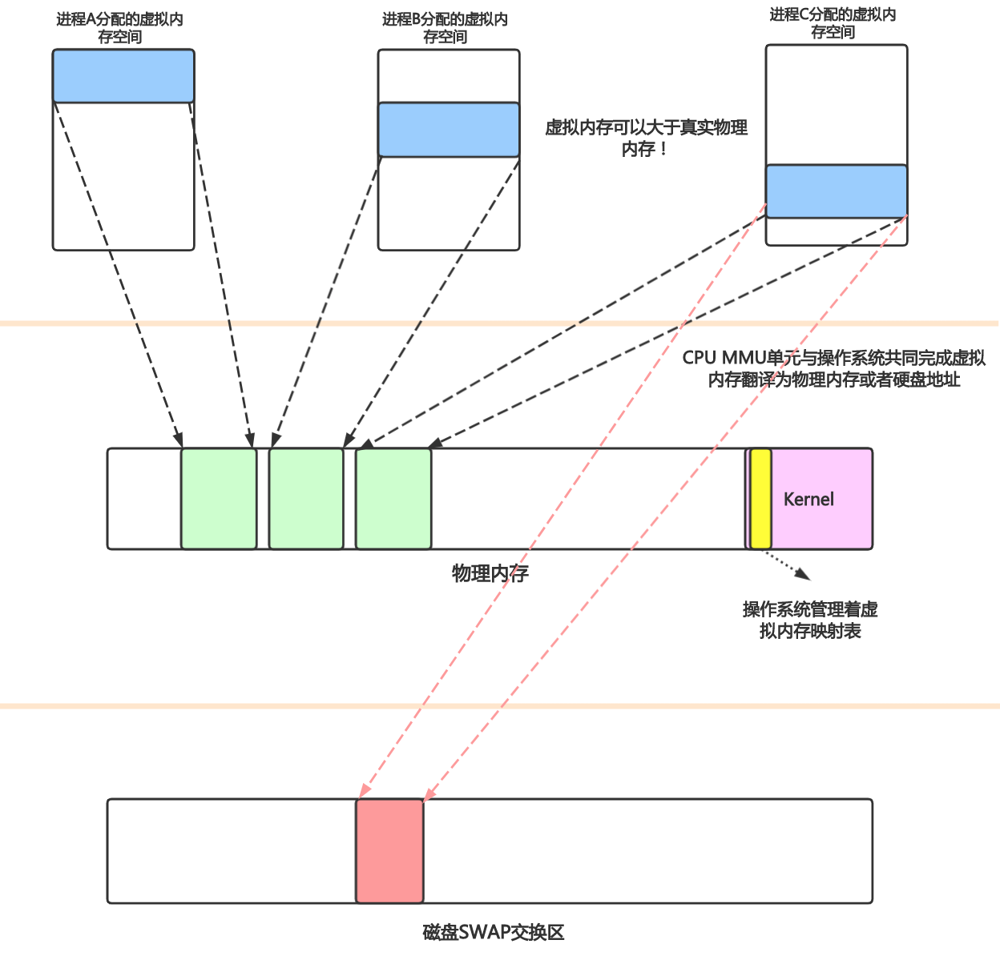
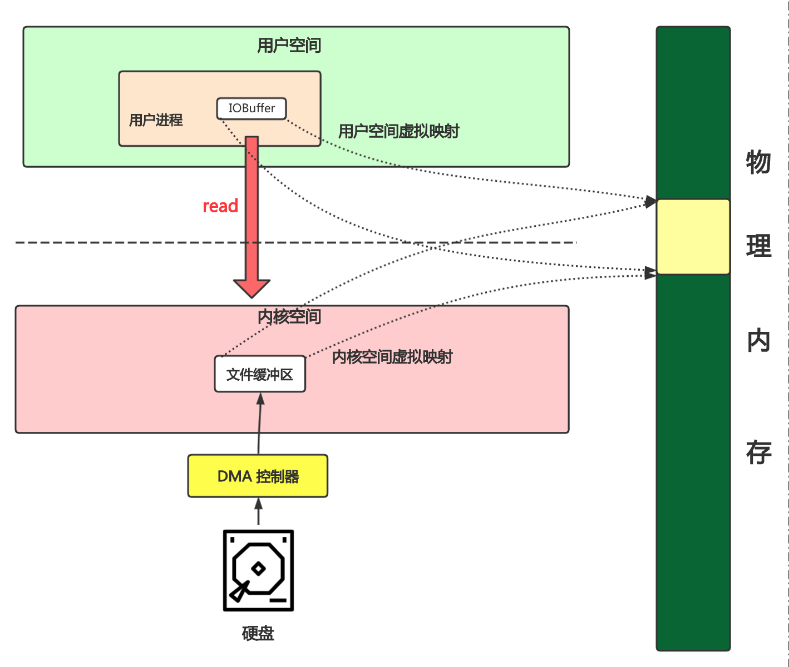

# 1. DMA(Direct Memory Access)控制器

外设与内存的数据访问速度相对于CPU是非常缓慢的. 因此DMA设备被发明出来, 协助CPU把"**内存与外设的读写**", "**内存与内存的读写**"这种低效操作交给DMA来执行, 使得CPU专注于执行擅长的计算处理.

# 2. 虚拟内存

- CPU MMU单元可以将虚拟内存映射(翻译)为物理内存或者硬盘地址(SWAP区). 
- 由于虚拟内存也可以映射到硬盘地址, 因此虚拟内存可以大于物理内存.

> MMU是Memory Management Unit的缩写，中文名是[内存管理](https://baike.baidu.com/item/内存管理)单元。它是一种负责处理[中央处理器](https://baike.baidu.com/item/中央处理器)（CPU）的[内存](https://baike.baidu.com/item/内存)访问请求的[计算机硬件](https://baike.baidu.com/item/计算机硬件)。它的功能包括[虚拟地址](https://baike.baidu.com/item/虚拟地址)到[物理地址](https://baike.baidu.com/item/物理地址)的转换（即[虚拟内存](https://baike.baidu.com/item/虚拟内存)管理）、内存保护、中央处理器[高速缓存](https://baike.baidu.com/item/高速缓存)的控制

假设用户进程需要读取文件,  若没有虚拟内存技术,  则需要在内核空间中, CPU让DMA控制器把文件从硬盘copy到内核环境的物理内存, 然后再copy到用户空间的目标物理内存.  之后通知用户进程去用户空间的物理内存读取数据. 

由于CPU MMU单元虚拟内存翻译到物理内存/硬盘的功能, 因此可以给**用户空间的用户进程缓冲区buffer分配的虚拟内存**与**内核空间的文件缓冲区的虚拟内存地址**翻译到**同一个内存地址**,进而减少了一次内存copy操作.  这就是`零拷贝的核心思想`.

# 3. NIO为何使用堆外内存

假设进程要给远程服务器发送数据. 

**1) 若不使用堆外内存**

Java堆内分配buffer数组, NIO把byte数组的位置和长度发给内核态的系统函数，内核空间的进程可以直接读取用户空间的数据(跨传输)到socket缓冲区. 若buffer数组较大(例如10M), 在内核进程读取用户空间的数据的时候发生了GC, GC会回收垃圾对象，会进行碎片整理，所以对象位置会变. 因此就悲剧了. 

**2) 使用堆外内存**

Java堆内分配buffer数组, 然后**copy到堆外内存**, 之后也是让内核态系统函数那堆外内存的数据读取到socket缓冲区.  由于堆外内存不归JVM管, 因此GC操作不到堆外内存.  但是多了一步COPY操作.

**3) 使用直接堆外内存**

JavaNIO也支持分配数据时候直接写到堆外内存. 直接避免了一次COPY操作. 

# 4. 堆外内存怎么管理

 

// todo 

DirectByteBuffer

Deallocator

`Cleaner extends PhantomReference<Object>` 

[参考 7.ReferenceHandler工作原理]: ../编程/JAVA/并发JUC/四种引用类型.md