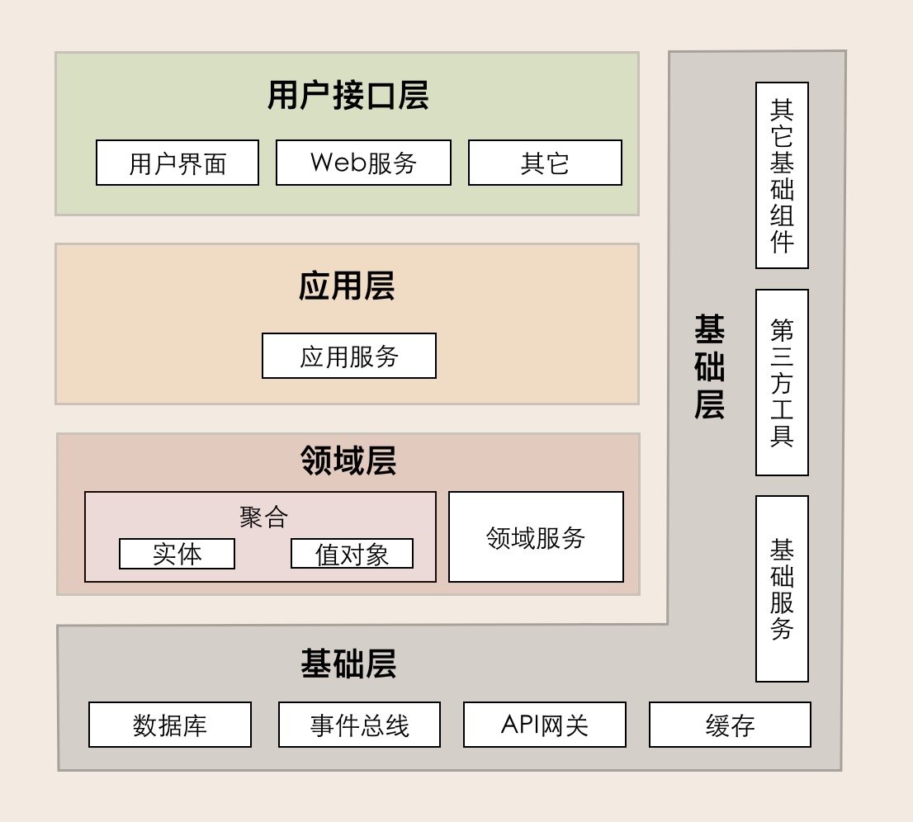
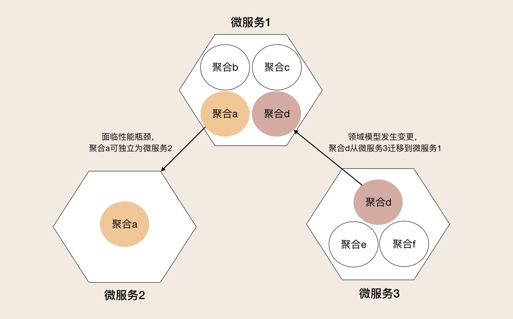
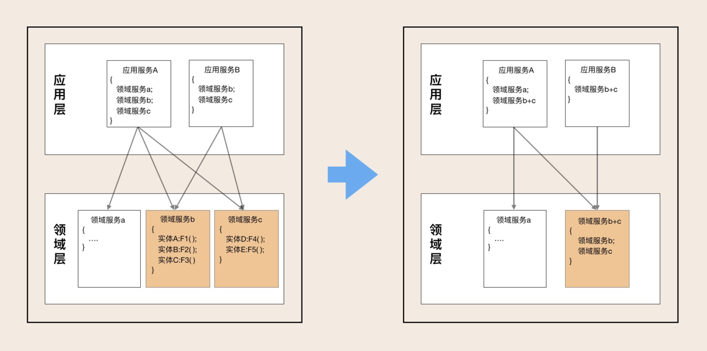
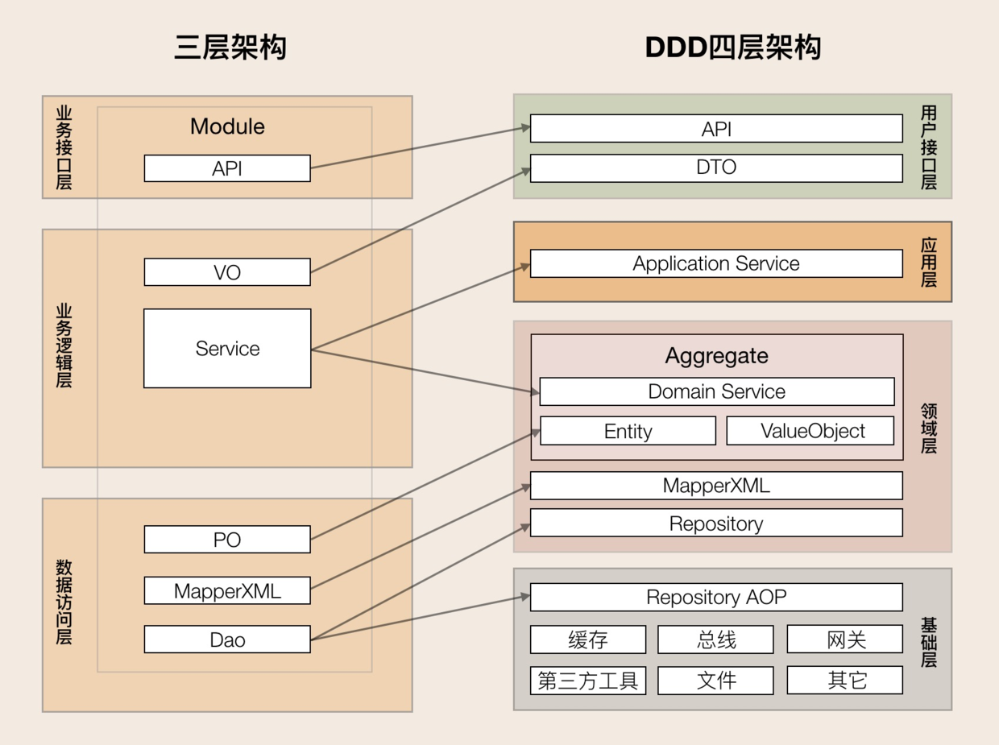
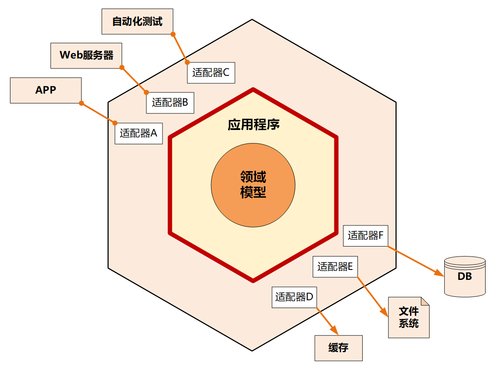
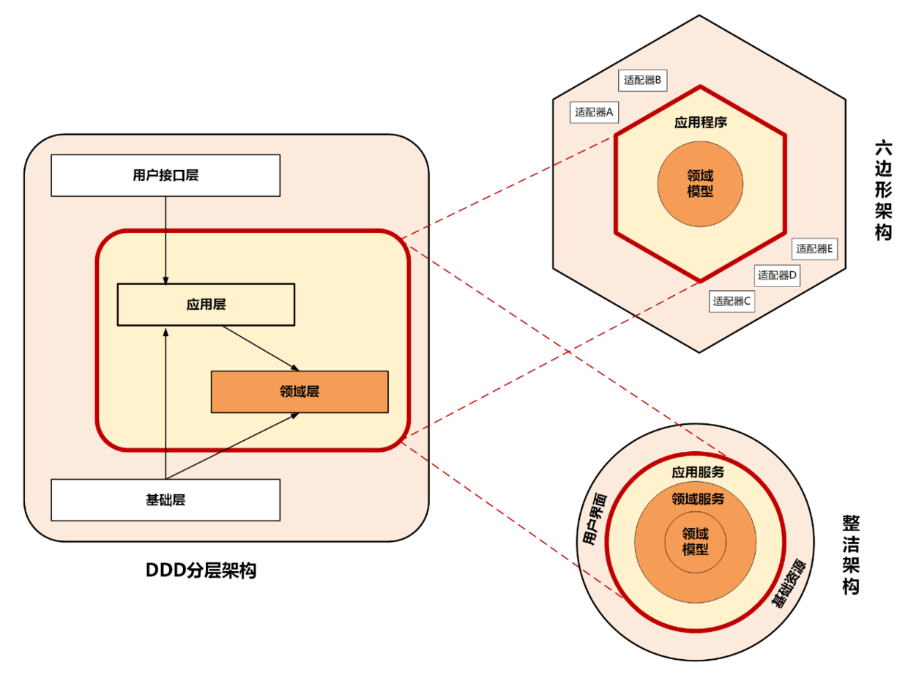
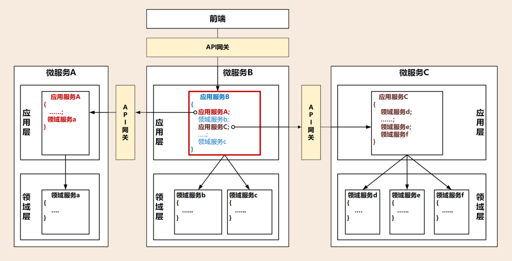
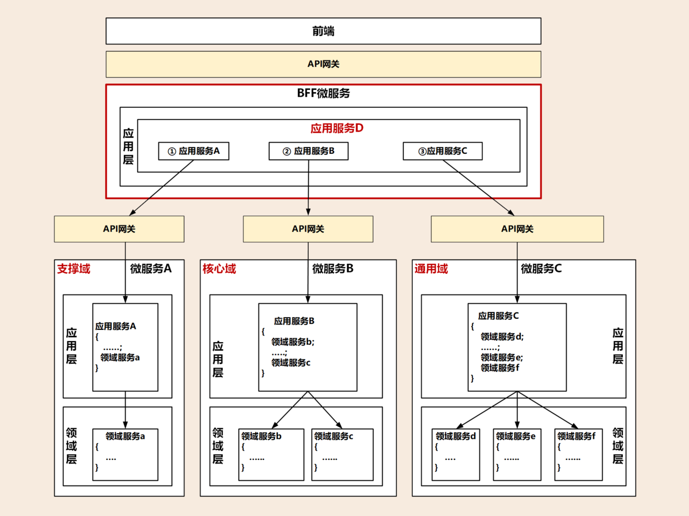

## 一. 领域事件：解耦微服务的关键

领域事件是领域模型中非常重要的一部分，用来表示领域中发生的事件。一个领域事件将导致进一步的业务操作，在实现业务解耦的同时，还有助于形成完整的业务闭环。

领域事件可以是业务流程的一个步骤，也可能是定时批处理过程中发生的事件，或者一个事件发生后触发的后续动作. 简单来说, 如果发生某种事件后，会触发进一步的操作，那么这个事件很可能就是领域事件。

> 原则: 一次事务最多只能更改一个聚合的状态。

如果一次业务操作涉及多个聚合状态的更改，应采用领域事件的最终一致性。

换句话说, 领域事件相当于一次可能涉及多个聚合领域的流程事件.

## DDD分层架构

1.用户接口层

用户接口层负责向用户显示信息和解释用户指令。这里的用户可能是：用户、程序、自动化测试和批处理脚本等等。

2.应用层

应用层是很薄的一层，理论上不应该有业务规则或逻辑，主要面向用例和流程相关的操作。
应用服务是在应用层的，它负责服务的组合、编排和转发，负责处理业务用例的执行顺序以及结果的拼装，以粗粒度的服务通过API网关向前端发布。还有，应用服务还可以进行安全认证、权限校验、事务控制、发送或订阅领域事件等。

3.领域层
领域层的作用是实现企业核心业务逻辑，通过各种校验手段保证业务的正确性。领域层主要体现领域模型的业务能力，它用来表达业务概念、业务状态和业务规则。

领域层包含聚合根、实体、值对象、领域服务等领域模型中的领域对象。

4.基础层

基础层是贯穿所有层的，它的作用就是为其它各层提供通用的技术和基础服务，包括第三方工具、驱动、消息中间件、网关、文件、缓存以及数据库等。比较常见的功能还是提供数据库持久化。

> DDD分层架构有一个重要的原则：每层只能与位于其下方的层发生耦合。

架构根据耦合的紧密程度又可以分为两种：严格分层架构和松散分层架构。优化后的DDD分层架构模型就属于严格分层架构，任何层只能对位于其直接下方的层产生依赖。

---

## 二. DDD分层架构如何推动架构演进

### 2.1 微服务架构的演进

以聚合为基础单元，完成领域模型和微服务架构的演进。聚合可以作为一个整体，在不同的领域模型之间重组或者拆分，或者直接将一个聚合独立为微服务。

- 当发现微服务1中聚合a的功能经常被高频访问，以致拖累整个微服务1的性能时，我们可以把聚合a的代码，从微服务1中剥离出来，独立为微服务2。这样微服务2就可轻松应对高性能场景。

- 在业务发展到一定程度以后，会发现微服务3的领域模型有了变化，聚合d会更适合放到微服务1的领域模型中。这时你就可以将聚合d的代码整体搬迁到微服务1中。如果你在设计时已经定义好了聚合之间的代码边界，这个过程不会太复杂，也不会花太多时间。

- 最后我们发现，在经历模型和架构演进后，微服务1已经从最初包含聚合a、b、c，演进为包含聚合b、c、d的新领域模型和微服务了。

### 2.2 微服务内服务的演进

服务演进的过程，它是随着你的系统发展的. 例如发现领域服务b和c同时多次被多个应用服务调用了，执行顺序也基本一致。这时你可以考虑将b和c合并，再将应用服务中b、c的功能下沉到领域层，演进为新的领域服务（b+c）。这样既减少了服务的数量，也减轻了上层服务组合和编排的复杂度。

---

### 2.3 三层架构如何演进到DDD分层架构

---

### 2.4 微服务架构模型：几种常见模型的对比和分析

### 整洁架构
整洁架构又名“洋葱架构”。它体现了分层的设计思想。

在整洁架构里，同心圆代表应用软件的不同部分，从里到外依次是领域模型、领域服务、应用服务和最外围的容易变化的内容，比如用户界面和基础设施。

整洁架构最主要的原则是依赖原则，它定义了各层的依赖关系，越往里依赖越低，代码级别越高，越是核心能力。外圆代码依赖只能指向内圆，内圆不需要知道外圆的任何情况。

在洋葱架构中，各层的职能是这样划分的：

- 领域模型实现领域内核心业务逻辑，它封装了企业级的业务规则。领域模型的主体是实体，一个实体可以是一个带方法的对象，也可以是一个数据结构和方法集合。
- 领域服务实现涉及多个实体的复杂业务逻辑。
- 应用服务实现与用户操作相关的服务组合与编排，它包含了应用特有的业务流程规则，封装和实现了系统所有用例。
- 最外层主要提供适配的能力，适配能力分为主动适配和被动适配。主动适配主要实现外部用户、网页、批处理和自动化测试等对内层业务逻辑访问适配。被动适配主要是实现核心业务逻辑对基础资源访问的适配，比如数据库、缓存、文件系统和消息中间件等。
- 红圈内的领域模型、领域服务和应用服务一起组成软件核心业务能力。

### 六边形架构
六边形架构又名“端口适配器架构”。

六边形架构的核心理念是：应用是通过端口与外部进行交互的。在下图的六边形架构中，红圈内的核心业务逻辑（应用程序和领域模型）与外部资源（包括APP、Web应用以及数据库资源等）完全隔离，仅通过适配器进行交互。

六边形架构将系统分为内六边形和外六边形两层，这两层的职能划分如下：

- 红圈内的六边形实现应用的核心业务逻辑；
- 外六边形完成外部应用、驱动和基础资源等的交互和访问，对前端应用以API主动适配的方式提供服务，对基础资源以依赖倒置被动适配的方式实现资源访问。

---

虽然DDD分层架构、整洁架构、六边形架构的架构模型表现形式不一样，但这三种架构模型的设计思想正是微服务架构高内聚低耦合原则的完美体现，而它们身上闪耀的正是以领域模型为中心的设计思想。

> 中台和微服务设计的关键是：领域模型和微服务的合理分层设计。

---

### 2.5 从三种架构模型看中台和微服务设计

中台本质上是领域的子域，它可能是核心域，也可能是通用域或支撑域。通常大家认为阿里的中台对应DDD的通用域，将通用的公共能力沉淀为中台，对外提供通用共享服务。

中台作为子域还可以继续分解为子子域，在子域分解到合适大小，通过事件风暴划分限界上下文以后，就可以定义微服务了，微服务用来实现中台的能力。表面上看，DDD、中台、微服务这三者之间似乎没什么关联，实际上它们的关系是非常紧密的，组合在一起可以作为一个理论体系用于你的中台和微服务设计。

#### 2.5.1 中台建设要聚焦领域模型
中台需要站在全企业的高度考虑能力的共享和复用。

中台设计时，我们需要建立中台内所有限界上下文的领域模型，DDD建模过程中会考虑架构演进和功能的重新组合。领域模型建立的过程会对业务和应用进行清晰的逻辑和物理边界（微服务）划分。领域模型的结果会影响到后续的系统模型、架构模型和代码模型，最终影响到微服务的拆分和项目落地。

因此，在中台设计中我们首先要聚焦领域模型，将它放在核心位置。

#### 2.5.2 微服务要有合理的架构分层 
微服务设计要有分层的设计思想，让各层各司其职，建立松耦合的层间关系。

**不要把与领域无关的逻辑放在领域层实现**，保证领域层的纯洁和领域逻辑的稳定，避免污染领域模型。**也不要把领域模型的业务逻辑放在应用层**，这样会导致应用层过于庞大，最终领域模型会失焦。如果实在无法避免，我们可以**引入防腐层**，进行新老系统的适配和转换，过渡期完成后，可以直接将防腐层代码抛弃。

有的微服务可以与前端应用集成，一起完成特定的业务，这是**项目级微服务**。而有的则是某个职责单一的中台微服务，企业级的业务流程需要将多个这样的微服务组合起来才能完成，这是**企业级中台微服务**。

- 项目级微服务
  项目级微服务的内部遵循分层架构模型就可以了。领域模型的核心逻辑在领域层实现，**服务的组合和编排在应用层实现**，通过API网关为前台应用提供服务，实现前后端分离。

  通常项目级微服务之间的集成，发生在微服务的应用层，由应用服务调用其它微服务发布在API网关上的应用服务。

- 企业级中台微服务
  企业级的业务流程往往是多个中台微服务一起协作完成的.
  在中台微服务之上增加一层BFF(服务于前端的后端，Backend for Frontends)，你看下面这张图，增加的这一层就位于红色框内，它的主要职能就是处理跨中台微服务的服务组合和编排，以及微服务之间的协调，它还可以完成前端不同渠道应用的适配。如果再将它的业务范围扩大一些，我可以将它做成一个面向不同行业和渠道的服务平台。

  **BFF**微服务与其它微服务存在较大的差异，就是它**没有领域模型**，因此这个微服务内也不会有领域层。BFF微服务可以承担应用层和用户接口层的主要职能，完成各个中台微服务的服务组合和编排，可以适配不同前端和渠道的要求。

#### 2.5.3 应用和资源的解耦与适配
传统以数据为中心的设计模式，应用会对数据库、缓存、文件系统等基础资源产生严重依赖。

正是由于它们之间的这种强依赖的关系，我们一旦更换基础资源就会对应用产生很大的影响，因此需要为应用和资源解耦。

**在微服务架构中，应用层、领域层和基础层解耦是通过仓储模式**，采用依赖倒置的设计方法来实现的。在应用设计中，我们会同步考虑和基础资源的代码适配，那么一旦基础设施资源出现变更（比如换数据库），就可以屏蔽资源变更对业务代码的影响，切断业务逻辑对基础资源的依赖，最终降低资源变更对应用的影响。
