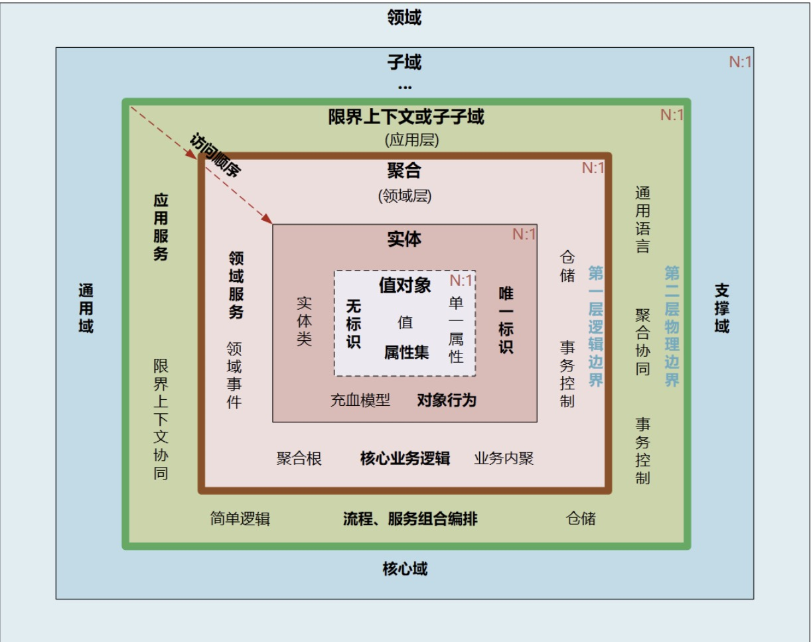

> DDD包括战略设计和战术设计两部分。

- 战略设计主要从**业务视角**出发，建立业务领域模型，划分领域边界，建立通用语言的限界上下文，限界上下文可以作为微服务设计的参考边界。

- 战术设计则从**技术视角**出发，侧重于领域模型的技术实现，完成软件开发和落地，包括：聚合根、实体、值对象、领域服务、应用服务和资源库等代码逻辑的设计和实现。

### 我们可以用三步来划定领域模型和微服务的边界。

- 第一步：在事件风暴中梳理业务过程中的用户操作、事件以及外部依赖关系等，根据这些要素梳理出领域实体等领域对象。

- 第二步：根据领域实体之间的业务关联性，将业务紧密相关的实体进行组合形成聚合，同时确定聚合中的聚合根、值对象和实体。在这个图里，聚合之间的边界是第一层边界，它们在同一个微服务实例中运行，这个边界是逻辑边界，所以用虚线表示。

- 第三步：根据业务及语义边界等因素，将一个或者多个聚合划定在一个限界上下文内，形成领域模型。在这个图里，限界上下文之间的边界是第二层边界，这一层边界可能就是未来微服务的边界，不同限界上下文内的领域逻辑被隔离在不同的微服务实例中运行，物理上相互隔离，所以是物理边界，边界之间用实线来表示。

> 领域建模和微服务建设的过程和方法基本类似，其**核心思想就是将问题域逐步分解，降低业务理解和系统实现的复杂度**。

# 1. 关键名词定义

## 领域, 子领域

在研究和解决业务问题时，DDD会按照一定的规则将业务领域进行细分，当领域细分到一定的程度后，DDD会将问题范围限定在特定的边界内，在这个边界内建立领域模型，进而用代码实现该领域模型，解决相应的业务问题。简言之，DDD的领域就是这个边界内要解决的业务问题域。

领域可以进一步划分为**子领域**。我们把划分出来的多个子领域称为子域，每个子域对应一个更小的问题域或更小的业务范围。

每一个细分的领域都会有一个知识体系，也就是DDD的领域模型。在所有子域的研究完成后，我们就建立了全域的知识体系了，也就建立了全域的领域模型。

## 核心域、通用域和支撑域

在领域不断划分的过程中，领域会细分为不同的子域，**子域**可以根据自身**重要性**和**功能属性**划分为**三类子域**，它们分别是：**核心域、通用域和支撑域**。
- 核心域: 决定产品和公司核心竞争力的子域，它是业务成功的主要因素和公司的核心竞争力。
- 通用域: 没有太多个性化的诉求，同时被多个子域使用的通用功能子域, 例如认证、权限等等。
- 支撑域: 必需的功能子域，但既不包含决定产品和公司核心竞争力的功能，也不包含通用功能的子域, 数据字典等系统。

划分核心域、通用域和支撑域，主要目的是资源分配. 因为每个公司的商业模式和战略方向不同, 资源侧重会不同.

## 限界上下文

用来封装通用语言和领域对象，提供上下文环境，保证在领域之内的一些术语、业务相关对象等（通用语言）有一个确切的含义，没有二义性.  **领域边界就是通过限界上下文来定义的。**

领域可以拆分为多个子领域。子域还可根据需要进一步拆分为子子域，拆到一定程度后，有些子子域的领域边界就可能变成限界上下文的边界了。

子域可能会包含多个限界上下文，也有可能子域本身的边界就是限界上下文边界。

理论上**限界上下文就是微服务的边界**。我们将限界上下文内的领域模型映射到微服务，就完成了从问题域到软件的解决方案。

## 领域事件 - 解耦微服务的关键

领域事件是领域模型中非常重要的一部分，用来表示领域中发生的事件。一个领域事件将导致进一步的业务操作，在实现业务解耦的同时，还有助于形成完整的业务闭环。

领域事件可以是业务流程的一个步骤，也可能是定时批处理过程中发生的事件，或者一个事件发生后触发的后续动作. 简单来说, 如果发生某种事件后，会触发进一步的操作，那么这个事件很可能就是领域事件。

> 原则: 一次事务最多只能更改一个聚合的状态。

如果一次业务操作涉及多个聚合状态的更改，应采用领域事件的最终一致性。

换句话说, 领域事件相当于一次可能涉及多个聚合领域的流程事件.

如果在通用语言中存在“当a发生时，我们就需要做到b。”这样的描述，则表明a可以定义成一个领域事件。领域事件的命名一般也就是“**产生事件的对象名称+完成的动作的过去式**”的形式，比如：订单已发货（OrderDispatchedEvent）、订单已收货和订单已确认（OrderConfirmedEvent）等事件。

- 领域事件可以是**业务流程的一个步骤**，例如订单提交，客户付费100元，订单完工等。
- 领域事件也可以是**定时发生的事情**，例如每晚对账完成。
- 领域事件也可以是**一个事件发生后引发的后续动作**，比如确认收货7天后自动将钱打到卖家账户，比如客户输错密码三次后发生锁定账户。

**在不同的问题域下领域事件是不同的。**

以宠物为例，如果做为宠物主人，你的问题域是如何养好一只猫，那么是不是已经打了疫苗，给宠物饲喂食物等将成为你关注的事情，领域事件会有：疫苗已注射，猫粮已饲喂等。

如果你是宠物医生，问题域是如何治好宠物的病，关注的事情是宠物的身体构成，准确的诊断宠物病情，对症下药，领域事件会有：病情已确诊，药方已开治。

## 命令

**命令就像是事件的动词, 一个命令可能会触发一个事件或者多个事件.**

比如实体是用户，命令是发布，产生了事件是文章已发布。
比如实体是用户，命令是喝水，产生的事件是用户已补充水分。

一个命令通常将对应到我们应用程序的一个API。

## 实体, 值对象

- 实体

拥有唯一标识符，且标识符在历经各种状态变更后仍能保持一致。比如商品是商品上下文的一个实体，通过唯一的商品ID来标识，不管这个商品的数据如何变化，商品的ID一直保持不变，它始终是同一个商品。

在战略设计时，领域模型中的实体是多个属性、操作或行为的载体。实体和值对象是组成领域模型的基础单元。

在代码模型中，实体的表现形式是实体类，这个类包含了实体的属性和方法，通过这些方法实现实体自身的业务逻辑。

- 值对象

通过对象属性值来识别的对象，它将多个相关的不可变属性组合为一个概念整体。
简单来说，值对象本质上就是一个包含若干个用于描述目的、具有整体概念和不可修改的属性集合。

例如人员实体原本包括：姓名、年龄、性别以及人员所在的省、市、县和街道等属性。这样显示地址相关的属性就很零碎了. 那么可以将“省、市、县和街道等属性”拿出来构成一个“地址属性集合”，这个集合就是值对象了。

本质上，实体是看得到、摸得着的实实在在的业务对象，实体具有业务属性、业务行为和业务逻辑。而值对象只是若干个属性的集合，只有数据初始化操作和有限的不涉及修改数据的行为，基本不包含业务逻辑。值对象的属性集虽然在物理上独立出来了，但在逻辑上它仍然是实体属性的一部分，用于描述实体的特征。

DDD引入值对象还有一个重要的原因, 就是DDD是从领域模型设计出发.

## 聚合（Aggregate）和聚合根（AggregateRoot）

- 聚合

领域模型内的实体和值对象就好比个体，而能让实体和值对象协同工作的组织就是聚合，它用来确保这些领域对象在实现共同的业务逻辑时，能保证数据的一致性。

  可以这么理解，聚合就是由业务和逻辑紧密关联的实体和值对象组合而成的，聚合是数据修改和持久化的基本单元，每一个聚合对应一个仓储，实现数据的持久化。

- 聚合根

聚合根的主要目的是为了避免由于复杂数据模型缺少统一的业务规则控制，而导致聚合、实体之间数据不一致性的问题。

如果把聚合比作组织，那聚合根就是这个组织的负责人。聚合根也称为根实体，它不仅是实体，还是聚合的管理者。

首先它作为实体本身，拥有实体的属性和业务行为，实现自身的业务逻辑。
其次它作为聚合的管理者，在聚合内部负责协调实体和值对象按照固定的业务规则协同完成共同的业务逻辑。
最后在聚合之间，它还是聚合对外的接口人，以聚合根ID关联的方式接受外部任务和请求，在上下文内实现聚合之间的业务协同。也就是说，聚合之间通过聚合根ID关联引用，如果需要访问其它聚合的实体，就要先访问聚合根，再导航到聚合内部实体，外部对象不能直接访问聚合内实体。

- 聚合设计原则
1. **在一致性边界内建模真正的不变条件。**聚合用来封装真正的不变性，而不是简单地将对象组合在一起。聚合内有一套不变的业务规则，各实体和值对象按照统一的业务规则运行，实现对象数据的一致性，边界之外的任何东西都与该聚合无关，这就是聚合能实现业务高内聚的原因。

2. **设计小聚合。**如果聚合设计得过大，聚合会因为包含过多的实体，导致实体之间的管理过于复杂，高频操作时会出现并发冲突或者数据库锁，最终导致系统可用性变差。而小聚合设计则可以降低由于业务过大导致聚合重构的可能性，让领域模型更能适应业务的变化。

3. **通过唯一标识引用其它聚合。**聚合之间是通过关联外部聚合根ID的方式引用，而不是直接对象引用的方式。外部聚合的对象放在聚合边界内管理，容易导致聚合的边界不清晰，也会增加聚合之间的耦合度。

4. **在边界之外使用最终一致性。**聚合内数据强一致性，而聚合之间数据最终一致性。在一次事务中，最多只能更改一个聚合的状态。如果一次业务操作涉及多个聚合状态的更改，应采用领域事件的方式异步修改相关的聚合，实现聚合之间的解耦（相关内容我会在领域事件部分详解）。

5. **通过应用层实现跨聚合的服务调用。**为实现微服务内聚合之间的解耦，以及未来以聚合为单位的微服务组合和拆分，应避免跨聚合的领域服务调用和跨聚合的数据库表关联。

#### 实体, 值对象, 聚合, 聚合根区分总结

**聚合的特点**：高内聚、低耦合，它是领域模型中最底层的边界，可以作为拆分微服务的最小单位，但我不建议你对微服务过度拆分。但在对性能有极致要求的场景中，聚合可以独立作为一个微服务，以满足版本的高频发布和极致的弹性伸缩能力。

一个微服务可以包含多个聚合，聚合之间的边界是微服务内天然的逻辑边界。有了这个逻辑边界，在微服务架构演进时就可以以聚合为单位进行拆分和组合了，微服务的架构演进也就不再是一件难事了。

**聚合根的特点**：聚合根是实体，有实体的特点，具有全局唯一标识，有独立的生命周期。一个聚合只有一个聚合根，聚合根在聚合内对实体和值对象采用直接对象引用的方式进行组织和协调，聚合根与聚合根之间通过ID关联的方式实现聚合之间的协同。

**实体的特点**：有ID标识，通过ID判断相等性，ID在聚合内唯一即可。状态可变，它依附于聚合根，其生命周期由聚合根管理。实体一般会持久化，但与数据库持久化对象不一定是一对一的关系。实体可以引用聚合内的聚合根、实体和值对象。

**值对象的特点**：无ID，不可变，无生命周期，用完即扔。值对象之间通过属性值判断相等性。它的核心本质是值，是一组概念完整的属性组成的集合，用于描述实体的状态和特征。值对象尽量只引用值对象。

---

## **领域模型**

>  “血”指的是domain object的model层内容

**失血模型**：只有getter/setter方法，没有任何业务逻辑，也不包含任何的实体关系。业务逻辑和应用逻辑都放到服务层中。这种类在Java中叫POJO。

优点：思路清晰，编写代码方便，所有业务都在service中。

缺点：service过重，业务中出现大概率重复调用的情况。

**贫血模型**：除了getter/setter方法外，贫血模型中包含了一些**与模型状态有关的业务逻辑**，但**不包含依赖持久层的业务逻辑**。这部分依赖于持久层的业务逻辑将会放到服务层中。依然是service-->DAO-->domain(entity)的层级关系。**贫血模型中的领域对象是不依赖于持久层的。**

优点：各层级单向依赖，结构清楚，很容易编写，也容易维护。稳定。

缺点：domain部分流转被封到了Service层，不够面向对象。Service也比较厚重。

**充血模型**：充血模型中包含了所有的业务逻辑，**包括依赖于持久层的业务逻辑**。所以，使用充血模型的领域层是依赖于持久层。调用关系变成了service --> domain <--> DAO。

优点：很面向对象。Service很薄，

缺点：DAO和domain双向依赖，存在很多问题。划分domain和service业务混杂，不同人员有不同理解。Service也需要调用domain的业务方法，相当于又封装了业务。

**胀血模型**：取消Service层，只保留domain-->DAO。胀血模型就是把和业务逻辑不想关的其他应用逻辑（如授权、事务等）都放到领域模型中, 服务层消失了，领域层干了服务层的事，到头来还是什么都没变。

优点：简化分层

缺点：业务暴露太多给Web层。service的业务也被强行加入了domain，可能引发domain不稳定。

四种模型中，失血和胀血模型，不应该被提倡，因为弊大于利。而贫血，充血这两种在技术上已经很成熟了。但是推荐使用贫血模型。因为充血模型中，DAO和domain双向依赖带来结构问题。而且在批量操作domain的结构，很不合理。**推荐使用贫血模型**，增加少量的业务在entity中。比如参数构造，getter/setter中加入少量的逻辑判断。编码优先级最高的是完成业务的同时，引起的BUG更少。至于是不是面向对象，BUG少就行了。

# 附录

- [DDD实战课-基于DDD的微服务拆分与设计](https://time.geekbang.org/column/intro/100037301)
- 我的网盘

