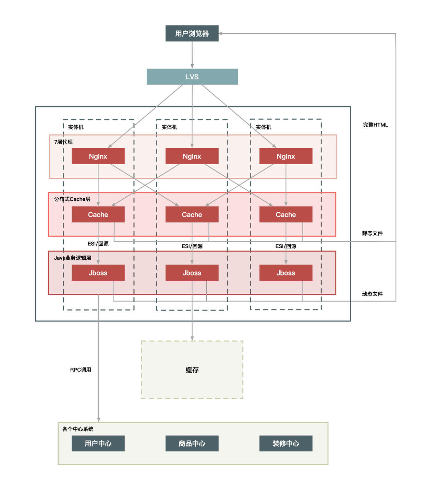
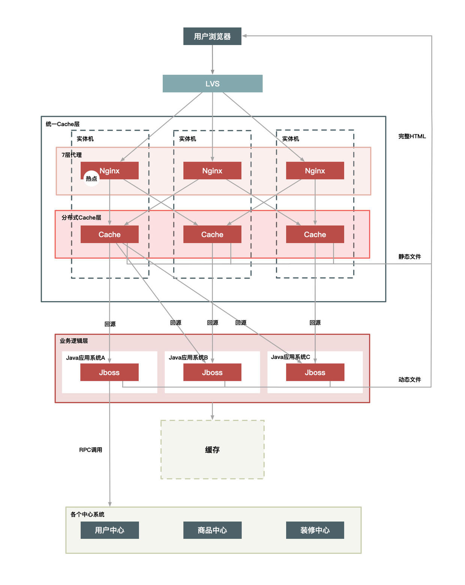
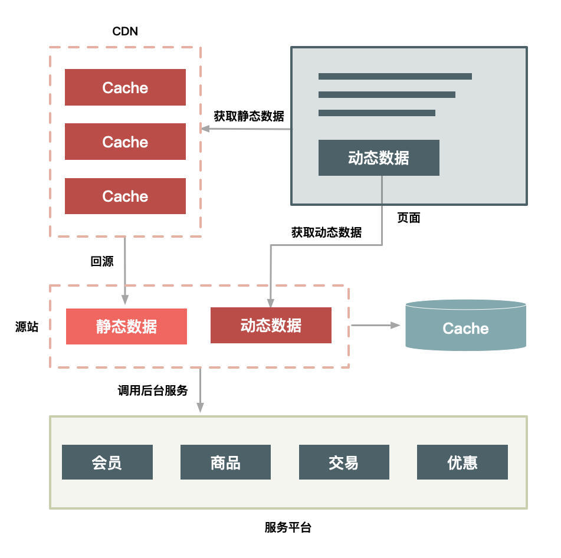

[极客原文内容](https://time.geekbang.org/column/article/40727)

#1. 动静分离
> 把用户的请求数据（包括HTML页面）划分为静态数据与动态数据。

两者的区分是: 数据是否和 URL（唯一）、浏览者（相关）、时间（服务器时间）、地域相关，以及是否含有 Cookie 等私密数据.
## 1.1 静态数据
静态数据是`相对`[^相对]不变的数据. 无论谁来请求浏览, 都是一样的数据. 
## 1.2 动态数据
含有与访问者相关的**个性化数据**

## 1.3 静态数据缓存方式
* **把静态数据缓存到离用户最近的地方**。常见方式: 用户浏览器里、CDN 上或者在服务端的 Cache 中。
* **直接缓存HTTP链接**。不是仅仅缓存数据，Web 代理服务器根据请求 URL，直接取出对应的 HTTP 响应头和响应体然后直接返回，这个响应过程简单得连 HTTP 协议都不用重新组装，甚至连 HTTP 请求头也不需要解析。
* **缓存数据的软件选择**。Web 服务器（如 Nginx、Apache、Varnish）会比Java容器更擅长处理大并发的静态文件请求[^Java弱点]。

## 1.4 动态数据处理方式
动态内容的处理通常有两种方案：**ESI（Edge Side Includes）**[^ESI]方案和 **CSI（Client Side Include）**方案。
* ESI 方案（或者 SSI）： 即在 Web 代理服务器上做动态内容请求，并将请求插入到静态页面中，当用户拿到页面时已经是一个完整的页面了。这种方式对服务端性能有些影响，但是用户体验较好。
*CSI 方案： 。即单独发起一个异步 请求向服务端获取动态内容。这种方式服务端性能更佳，但是用户端页面可能会延时，体验稍差。

#1. 动静分离的几种架构方案
动静分离后，如何组合再完整展示给用户。
根据架构上的复杂度，有 3 种方案可选（难度低 -> 高）：
* 实体机单机部署
* 统一 Cache 层
* 上 CDN。

1. 方案一: 实体机单机部署

2. 方案二: 在方案一基础上, 分离出统一Cache层

2. 方案三: 静态数据上CDN

[^相对]: 相对不变指的是某些情况下不会变化的数据, 但最终还是可能会变化的. 某些情况可以是一段时间, 一定的条件。
[^Java弱点]: Java 系统本身也有其弱点（比如不擅长处理大量连接请求，每个连接消耗的内存较多，Servlet 容器解析 HTTP 协议较慢。
[^ESI]: [ESI注入](https://www.anquanke.com/post/id/103641)
