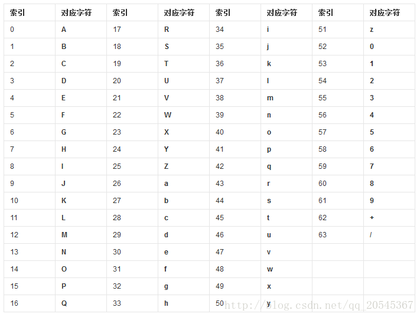
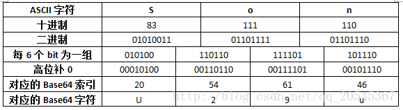
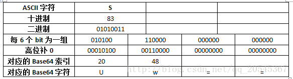

>  百度百科中对Base64有一个很好的解释：“Base64是网络上最常见的用于传输8Bit字节码的编码方式之一，Base64就是一种基于64个可打印字符来表示二进制数据的方法”。

- 什么是“可打印字符”呢？

- 为什么要用它来传输8Bit字节码呢？

  

在回答这两个问题之前我们有必要来思考一下什么情况下需要使用到Base64？

Base64一般用于在HTTP协议下传输二进制数据，由于HTTP协议是文本协议，所以在HTTP协议下传输二进制数据需要将二进制数据转换为字符数据。然而直接转换是不行的。因为**网络传输只能传输可打印字符**。什么是可打印字符？在**ASCII码**中规定，0~31、127这33个字符属于控制字符，**32~126这95个字符属于可打印字符**，也就是说网络传输只能传输这95个字符，不在这个范围内的字符无法传输。那么该怎么才能传输其他字符呢？其中一种方式就是使用Base64。

**Base64，就是使用64个可打印字符来表示二进制数据的方法**。Base64的索引与对应字符的关系如下表所示：

​    

也就是说，如果将索引转换为对应的二进制数据的话需要至多6个Bit(64 = 2<sup>6</sup>)。然而**ASCII码需要8个Bit**来表示，那么怎么使用6个Bit来表示8个Bit的数据呢？6个Bit当然不能存储8个Bit的数据，但是4 * 6个Bit可以存储3 * 8个Bit的数据啊！如下表所示：

​    

可以看到“Son”通过Base64编码转换成了“U29u”。这是刚刚好的情况，3个ASCII字符刚好转换成对应的4个Base64字符。但是，当需要转换的字符数不是3的倍数的情况下该怎么办呢？**Base64规定，当需要转换的字符不是3的倍数时，一律采用补0的方式凑足3的倍数**，具体如下表所示：

​    

每6个Bit为一组，第一组转换后为字符“U”，第二组末尾补4个0转换后为字符“w”。剩下的使用“=”替代。即字符“S”通过Base64编码后为“Uw==”。这就是Base64的编码过程。


# Java中实现Base64

```java
package com.first;
 
import org.junit.Test;
 
import java.io.UnsupportedEncodingException;
import java.util.Base64;
 
public class Test {
 
    @Test
    public void test() throws UnsupportedEncodingException {
        // 编码
        String encode = Base64.getEncoder().encodeToString("So".getBytes("UTF-8"));
        System.out.println(encode);
        // 解码
        byte[] decode = Base64.getDecoder().decode(encode);
        System.out.println(new String(decode, "UTF-8"));
    }
 
}
```

