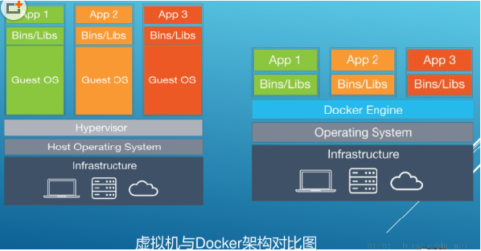

# Docker简介


Docker 是一个 C/S 模式的架构，后端是一个松耦合架构，众多模块各司其职。 

Docker运行的基本流程:

1. 用户是使用Docker client与Docker Daemon进程建立通信, 并发送请求给后者.
2. Docker Daemon作为Docker架构的主体部分, 提供Docker Server的功能使其可以接受client的请求.
3. Docker Engine执行Docker内部的一系列工作, 每一项工作都是以一个Job的形式存在.
4. Job的运行过程中, 当需要容器镜像时, 则从Docker Registry下载镜像, 并通过镜像管理驱动Graph driver将下载的镜像以Graph的形式存储.
5. 当需要为Docker创建网络环境时, 通过网络管理驱动Network driver创建并配置Docker容器的网络环境.
6. 当需要限制Docker容器运行支援或者执行用户指令等操作时, 则通过Exec driver完成.
7. Libcontainer是一箱独立的容器管理包, Network driver与Exec driver都是通过Libcontainer来实现具体对容器的操作.


##  环境要求


Linux **64bit**, **内核3.8+**


## docker比虚拟机vm快的原因

- docker有着比虚拟机更少的抽象层
  由于docker不需要Hypervisor(虚拟机)实现硬件资源虚拟化,运行在docker容器上的程序直接使用的都是实际物理机的硬件资源。因此在CPU、内存利用率上docker将会在效率上有明显优势。
- docker利用的是宿主机的内核, 而不需要加载操作系统OS内核
  当新建一个容器时,docker不需要和虚拟机一样重新加载一个操作系统内核。进而避免引寻、加载操作系统内核返回等比较费时费资源的过程, 当新建一个虚拟机时,虚拟机软件需要加载OS,返回新建过程是分钟级别的。而docker由于直接利用宿主机的操作系统,则省略了返回过程,因此新建一个docker容器只需要几秒钟。




## 阿里云公共registry仓库

http://mirrors.aliyun.com/docker-ce/linux/centos/docker-ce.repo


# 基本组成


## 镜像image


是一个只读模板, 用来创建容器, 相当于一个root文件系统.  


## 容器container


容器是镜像运行时的实例, 容器为镜像提供一个标准和隔离的运行环境. 可以启动, 开始, 停止, 删除操作.

可以把容器看成一个**简易版的linux环境**(包含`root用户空间, 进程空间, 用户空间, 网络空间等`) 以及 **运行在其中的应用程序**.


## 仓库repository

存放镜像文件的地方.  `与maven仓库概念类似`

- 公开仓库
  - Docker公司提供官方[`Registry`]仓库: `hub.docker.com`. 
  - 阿里云镜像
- 私有仓库
  - 公司自建


# 常用命令


## 帮助/启动类

```shell
# 启动docker
systemctl start docker
# 停止docker
systemctl stop docker
# 重启docker
systemctl restart docker
# 查看docker状态
systemctl status docker
# 开机启动
systemctl enable docker

# 查看docker概要信息
docker info
# 查看docker总体帮助文档
docker --help
docker [具体命令] --help
```


## 镜像命令

```shell
# 列出本地所有镜像
docker images
# 从公共仓库搜索镜像
docker search [镜像]
# 从公共仓库拉取镜像
docker pull [镜像名字]:[tag]
# 查看镜像/容器/数据卷所占的空间
docker system df 
# 删除指定镜像
docker rmi [镜像id]
```


**docker虚悬镜像是什么？**

虚悬镜像（dangling image）: 仓库名、标签均为<none>的镜像.

这个镜像原本是有镜像名和标签的，原来为 mongo:3.2 ，随着官方镜像维护，发布了新版本后，重新docker pull mongo:3.2时， mongo:3.2 这个镜像名被 转移到了新下载的镜像身上，而旧的镜像上的这个名称则被取消，从而成为了 。

除了 docker pull 可能导致这种情况， docker build 也同样可以导致这种现象。由于新旧镜像同名，旧镜像名称被取消，从而出现仓库名、标签均为<none>的镜像。


一般来说，**虚悬镜像已经失去了存在的价值，是可以随意删除的**。

```shell
# 查询显示虚悬镜像
docker images -f dangling=true
# 删除虚悬镜像
docker rmi $(docker images -q -f dangling=true)
```


## 容器命令


### 启动容器

`docker run [OPTIONS] IMAGE [COMMAND] [ARG...]`


**OPTIONS**说明（常用）：有些是一个减号，有些是两个减号

--name=容器新名字       为容器指定一个名称；
-d:  detach, 后台运行容器并返回容器ID，也即启动守护式容器(后台运行)；

-i: interactive, 以交互模式运行容器，通常与 -t 同时使用；
-t: tty, 为容器重新分配一个伪输入终端，通常与 -i 同时使用；
也即启动交互式容器(前台有伪终端，等待交互)；

-P: 随机端口映射，大写P
-p: 指定端口映射，小写p


eg:

以**前台交互模式**启动一个centos, 在容器内执行/bin/bash命令。

```shell
[root@test ~]# docker run -it --name=my-centos1 centos bin/bash
[root@873f95209ac4 /]# uname -a
Linux 873f95209ac4 3.10.0-1062.el7.x86_64 #1 SMP Wed Aug 7 18:08:02 UTC 2019 x86_64 x86_64 x86_64 GNU/Linux
```


以**后台守护模式**启动一个centos

```shell
[root@test ~]# docker run -d redis:6.0.8
b6a31ae90499b78a49f5daa1fe0aad04e1d66160cd6674706c1df1b018040600
```


### 列出当前所有正在运行的容器

`docker ps [OPTIONS]`

OPTIONS说明（常用）:

-a: 列出当前所有正在运行的容器+历史上运行过的
-l: 显示最近创建的容器。
-n: 显示最近n个创建的容器。
-q: 静默模式，只显示容器编号。

```shell
[root@test ~]# docker ps
CONTAINER ID   IMAGE     COMMAND       CREATED              STATUS              PORTS     NAMES
e1f451777a76   centos    "/bin/bash"   About a minute ago   Up About a minute             my-centos1
6ccc5db1a2f8   centos    "/bin/bash"   About a minute ago   Up About a minute             cool_lalande
```


### 退出容器

- exit

run进去容器，`exit`退出，容器停止

- ctrl+p+q

run进去容器，`ctrl+p+q`退出，但**容器不停止**


###　启动已停止运行的容器

`docker start [容器ID或者容器名]`

### 重启容器

`docker restart [容器ID或者容器名]`

### 停止容器

`docker stop [容器ID或者容器名]`

### 强制停止容器

`docker kill [容器ID或者容器名]`

### 删除已停止的容器

`docker rm [容器ID]`

一次性删除多个容器实例

`docker rm -f $(docker ps -a -q)`

`docker ps -a -q | xargs docker rm`


### 进入正在运行的容器并以命令行交互

- `docker exec -it [容器ID] `

  exec 是在容器中打开新的终端，并且可以启动新的进程
  **用exit退出，不会导致容器的停止**。

- `docker attach -it [容器ID ]`

  attach 直接进入容器启动命令的终端，不会启动新的进程
  **用exit退出，会导致容器的停止**。


**一般用-d后台启动的程序，再用exec进入对应容器实例**


### 查看容器日志

`docker logs -f -n 500 [容器id]`

### 查看容器内运行的进程

`docker top [容器ID]`


### 查看容器内部细节

`docker inspect [容器ID]`


### 从容器内拷贝文件到docker宿主机上

`docker cp 容器ID:容器内路径 宿主机路径`


### 导入和导出(备份)容器

- export 导出容器的内容留作为一个tar归档文件

  `docker export [容器ID] > 文件名.tar`

  `docker export [容器ID] -o 文件名.tar`

- import 从tar包中的内容创建一个新的文件系统再导入为镜像

  `docker import 文件名.tar -- [镜像用户/镜像名:镜像版本号]`

  `cat 文件名.tar | docker import - [镜像用户/镜像名:镜像版本号]`


### 提交容器副本使之成为一个新的镜像

`docker commit -m=备注 -a=作者 [容器ID] [新镜像名]:[tag]`


  


# Docker镜像原理


## UnionFS 联合文件系统

联合文件系统（UnionFS）是一种分层、轻量级并且高性能的文件系统，它支持对文件系统的修改作为一次提交来一层层的叠加，同时可以将不同目录挂载到同一个虚拟文件系统下(unite several directories into a single virtual filesystem)。**UnionFS是 Docker 镜像的基础。镜像可以通过分层来进行继承，基于基础镜像（父镜像），可以制作各种具体的应用镜像**。

特性: 一次同时加载多个文件系统，但从外面看起来，只能看到一个文件系统，联合加载会把各层文件系统叠加起来，这样最终的文件系统会包含所有底层的文件和目录. 


## Docker镜像加载原理

docker镜像实际上由一层一层的文件系统组成，这种层级的文件系统UnionFS。

- bootfs(boot file system)

  主要包含bootloader和kernel, bootloader主要是引导加载kernel, Linux刚启动时会加载bootfs文件系统，在Docker镜像的最底层是引导文件系统bootfs。这一层与我们典型的Linux/Unix系统是一样的，包含boot加载器和内核。当boot加载完成之后整个内核就都在内存中了，此时内存的使用权已由bootfs转交给内核，此时系统也会卸载bootfs。

- rootfs (root file system) ，

  在bootfs之上。包含的就是典型 Linux 系统中的 /dev, /proc, /bin, /etc 等标准目录和文件。rootfs就是各种不同的操作系统发行版，比如Ubuntu，Centos等等。 


平时我们安装进虚拟机的CentOS都是好几个G，为什么docker这里才200M？？

对于一个精简的OS，rootfs可以很小，只需要包括最基本的命令、工具和程序库就可以了，因为底层直接用Host的kernel，自己只需要提供 rootfs 就行了。由此可见对于不同的linux发行版, bootfs基本是一致的, rootfs会有差别, 因此不同的发行版可以公用bootfs。


镜像分层最大的一个好处就是**共享资源，方便复制迁移**，就是为了**复用**。比如说有多个镜像都从相同的 base 镜像构建而来，那么 Docker Host 只需在磁盘上保存一份 base 镜像；同时内存中也只需加载一份 base 镜像，就可以为所有容器服务了。而且镜像的每一层都可以被共享。

 

**Docker镜像层都是只读的，容器层才是可写的.**

当容器启动时，一个新的可写层被加载到镜像的顶部。这一层通常被称作“容器层”，“容器层”之下的都叫“镜像层”。

新镜像是从 base 镜像一层一层叠加生成的。每修改并commit一次，就在现有镜像的基础上增加一层。

所有对容器的改动 - 无论添加、删除、还是修改文件都只会发生在容器层中。只有容器层是可写的，容器层下面的所有镜像层都是只读的。


# 搭建私服


## 拉取并启动Docker Registry

`docker run -d -p 5000:5000  -v /hyc/myregistry/:/tmp/registry --privileged=true registry`

-v: 数据卷映射. 把容器的指定目录映射到宿主机的一个目录. 实现容器的数据持久化到宿主机的目录, 防止容器停止后数据丢失.

格式: 

-v [宿主机目录绝对路径]:[容器内目录绝对路径]


```shell
# 拉取私服镜像
docker pull registry

# 修改docker配置文件使支持http, 新增"insecure-registries": ["宿主机ip:5000"]
[root@test ~]# vi /etc/docker/daemon.json

{
  "registry-mirrors": ["https://icp80ca3.mirror.aliyuncs.com"],
  "insecure-registries": ["私服宿主机ip:端口"]
}

# 修改完建议重启docker
systemctl restart docker

# 启动
docker run -d -p 5000:5000  -v /hyc/myregistry/:/tmp/registry --privileged=true registry
```


## 将镜像修改符合私服规范的Tag

`docker tag [镜像名]:[tag] 私服宿主机ip:[端口]/[镜像名]:[tag]`

```shell
[root@test ~]# docker tag myubuntu:1.0 192.168.1.139:5000/myubuntu:1.1
[root@test ~]# docker images 
REPOSITORY                                         TAG       IMAGE ID       CREATED          SIZE
192.168.1.139:5000/myubuntu                        1.1       a4958246806a   27 minutes ago   174MB
myubuntu                                           1.0       a4958246806a   27 minutes ago   174MB
registry                                           latest    b8604a3fe854   7 weeks ago      26.2MB
ubuntu                                             latest    ba6acccedd29   2 months ago     72.8MB
hello-world                                        latest    feb5d9fea6a5   3 months ago     13.3kB
centos                                             latest    5d0da3dc9764   3 months ago     231MB
```


## push本地镜像到私服

``docker push [镜像名]:[tag] ` 

```shell
[root@test ~]# docker push 192.168.1.139:5000/myubuntu:1.1
The push refers to repository [192.168.1.139:5000/myubuntu]
b4c15bcc6e84: Pushed 
9f54eef41275: Pushed 
1.1: digest: sha256:c8f3b7793b0be57e42fafa7a36c8b53a4d130d85fa700bed44d48295bb37fff2 size: 741
```


## curl验证私服库上有什么镜像

```shell
[root@test ~]# curl -XGET http://192.168.1.139:5000/v2/_catalog
{"repositories":["myubuntu"]}
```


## 从私服pull镜像到本地

`docker pull [私服宿主机ip]:[端口]/myubuntu:1.1`

```shell
[root@threegene-biz-kfus23d-test ~]# docker images 
REPOSITORY                                         TAG       IMAGE ID       CREATED          SIZE
192.168.1.139:5000/myubuntu                        1.1       a4958246806a   41 minutes ago   174MB
registry.cn-shenzhen.aliyuncs.com/bearo/myubuntu   1.1       7fd0a6d9fe52   2 hours ago      174MB
tomcat                                             latest    fb5657adc892   2 weeks ago      680MB
redis                                              latest    7614ae9453d1   2 weeks ago      113MB
registry                                           latest    b8604a3fe854   7 weeks ago      26.2MB
ubuntu                                             latest    ba6acccedd29   2 months ago     72.8MB
hello-world                                        latest    feb5d9fea6a5   3 months ago     13.3kB
centos                                             latest    5d0da3dc9764   3 months ago     231MB

# 删除本地镜像 192.168.1.139:5000/myubuntu:1.1
[root@threegene-biz-kfus23d-test ~]# docker rmi a4958246806a
Untagged: 192.168.1.139:5000/myubuntu:1.1
Untagged: 192.168.1.139:5000/myubuntu@sha256:c8f3b7793b0be57e42fafa7a36c8b53a4d130d85fa700bed44d48295bb37fff2
Deleted: sha256:a4958246806a3efb6bacfda9ff91c9294bf744afb0fc6c9b018799d50172fef3
Deleted: sha256:ff2574102e1b41a123435d26f8196f81643a8633d6db179a88c43eefa9da56db

# 从私服pull
[root@threegene-biz-kfus23d-test ~]# docker pull 192.168.1.139:5000/myubuntu:1.1
1.1: Pulling from myubuntu
7b1a6ab2e44d: Already exists 
8dd2a27ee2f5: Pull complete 
Digest: sha256:c8f3b7793b0be57e42fafa7a36c8b53a4d130d85fa700bed44d48295bb37fff2
Status: Downloaded newer image for 192.168.1.139:5000/myubuntu:1.1
192.168.1.139:5000/myubuntu:1.1
```


# 容器数据卷


