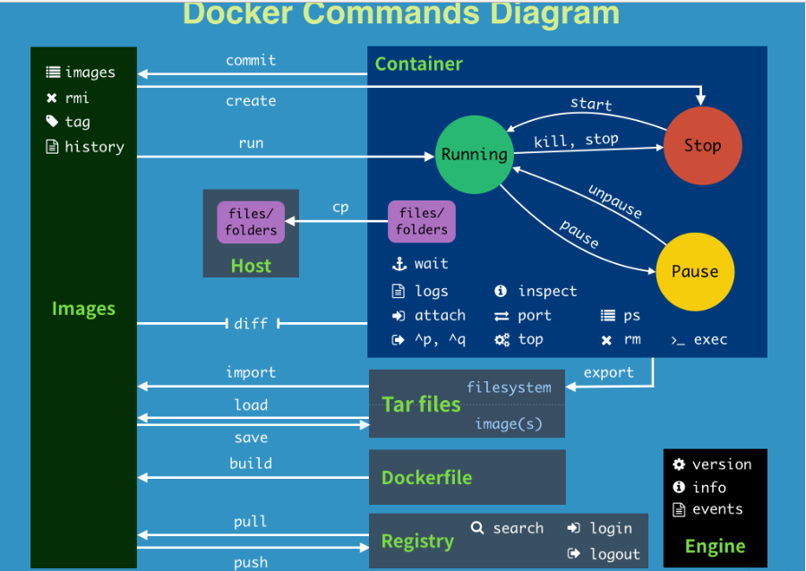
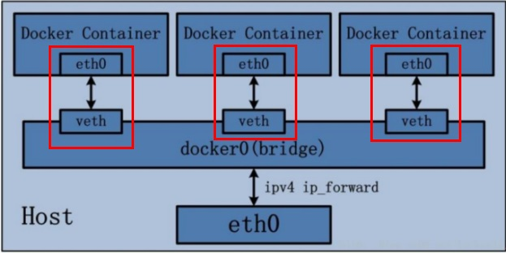
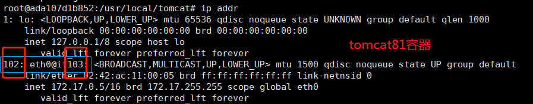
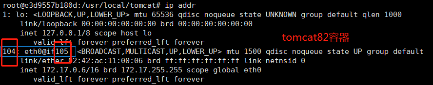
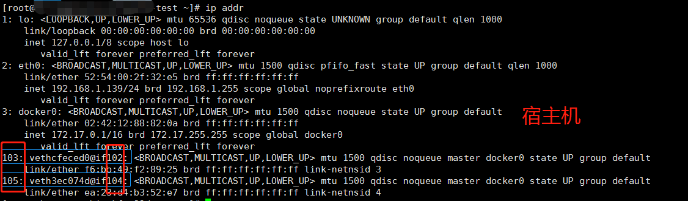
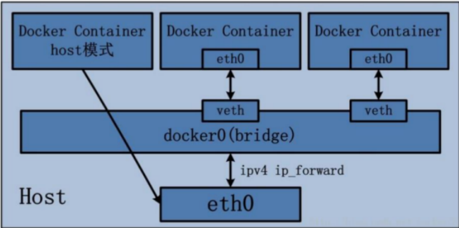
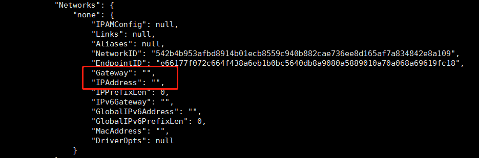
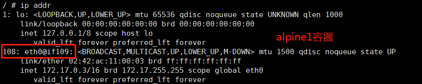
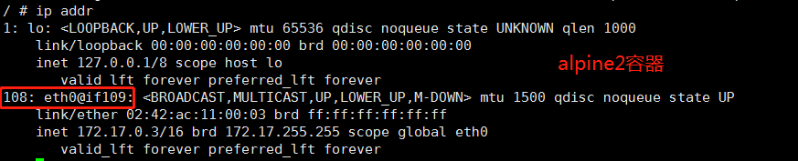
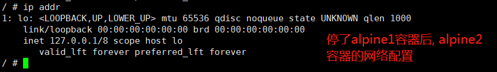

# Docker简介


Docker 是一个 C/S 模式的架构，后端是一个松耦合架构，众多模块各司其职。 

Docker运行的基本流程:

1. 用户是使用Docker client与Docker Daemon进程建立通信, 并发送请求给后者.
2. Docker Daemon作为Docker架构的主体部分, 提供Docker Server的功能使其可以接受client的请求.
3. Docker Engine执行Docker内部的一系列工作, 每一项工作都是以一个Job的形式存在.
4. Job的运行过程中, 当需要容器镜像时, 则从Docker Registry下载镜像, 并通过镜像管理驱动Graph driver将下载的镜像以Graph的形式存储.
5. 当需要为Docker创建网络环境时, 通过网络管理驱动Network driver创建并配置Docker容器的网络环境.
6. 当需要限制Docker容器运行支援或者执行用户指令等操作时, 则通过Exec driver完成.
7. Libcontainer是一箱独立的容器管理包, Network driver与Exec driver都是通过Libcontainer来实现具体对容器的操作.


##  环境要求


Linux **64bit**, **内核3.8+**


## docker比虚拟机vm快的原因

- docker有着比虚拟机更少的抽象层
  由于docker不需要Hypervisor(虚拟机)实现硬件资源虚拟化,运行在docker容器上的程序直接使用的都是实际物理机的硬件资源。因此在CPU、内存利用率上docker将会在效率上有明显优势。
- docker利用的是宿主机的内核, 而不需要加载操作系统OS内核
  当新建一个容器时,docker不需要和虚拟机一样重新加载一个操作系统内核。进而避免引寻、加载操作系统内核返回等比较费时费资源的过程, 当新建一个虚拟机时,虚拟机软件需要加载OS,返回新建过程是分钟级别的。而docker由于直接利用宿主机的操作系统,则省略了返回过程,因此新建一个docker容器只需要几秒钟。


## 阿里云公共registry仓库

http://mirrors.aliyun.com/docker-ce/linux/centos/docker-ce.repo


# 基本组成


## 镜像image


是一个只读模板, 用来创建容器, 相当于一个root文件系统.  


## 容器container


容器是镜像运行时的实例, 容器为镜像提供一个标准和隔离的运行环境. 可以启动, 开始, 停止, 删除操作.

可以把容器看成一个**简易版的linux环境**(包含`root用户空间, 进程空间, 用户空间, 网络空间等`) 以及 **运行在其中的应用程序**.


## 仓库repository

存放镜像文件的地方.  `与maven仓库概念类似`

- 公开仓库
  - Docker公司提供官方[`Registry`]仓库: `hub.docker.com`. 
  - 阿里云镜像
- 私有仓库
  - 公司自建


# 常用命令


## 帮助/启动类

```shell
# 启动docker
systemctl start docker
# 停止docker
systemctl stop docker
# 重启docker
systemctl restart docker
# 查看docker状态
systemctl status docker
# 开机启动
systemctl enable docker

# 查看docker概要信息
docker info
# 查看docker总体帮助文档
docker --help
docker [具体命令] --help
```


## 镜像命令

```shell
# 列出本地所有镜像
docker images
# 从公共仓库搜索镜像
docker search [镜像]
# 从公共仓库拉取镜像
docker pull [镜像名字]:[tag]
# 查看镜像/容器/数据卷所占的空间
docker system df 
# 删除指定镜像
docker rmi [镜像id]
```


**docker虚悬镜像是什么？**

虚悬镜像（`dangling image`）: 仓库名、标签均为<none>的镜像.

这个镜像原本是有镜像名和标签的，原来为 mongo:3.2 ，随着官方镜像维护，发布了新版本后，重新docker pull mongo:3.2时， mongo:3.2 这个镜像名被 转移到了新下载的镜像身上，而旧的镜像上的这个名称则被取消，从而成为了 。

除了 docker pull 可能导致这种情况， docker build 也同样可以导致这种现象。由于新旧镜像同名同tag，旧镜像名称被取消，从而出现仓库名、标签均为<none>的镜像。


一般来说，**虚悬镜像已经失去了存在的价值，是可以随意删除的**。

```shell
# 查询显示虚悬镜像
docker images -f dangling=true
# 删除虚悬镜像
docker rmi $(docker images -q -f dangling=true)
docker image prune
```


## 容器命令


### 启动容器

`docker run [OPTIONS] IMAGE [COMMAND] [ARG...]`


**OPTIONS**说明（常用）：有些是一个减号，有些是两个减号

- --name=容器新名字: 为容器指定一个名称；
- -d:  detach, 后台运行容器并返回容器ID，也即启动守护式容器(后台运行)；

- -i: interactive, 以交互模式运行容器，通常与 -t 同时使用；
- -t: tty, 为容器重新分配一个伪输入终端，通常与 -i 同时使用；
  也即启动交互式容器(前台有伪终端，等待交互)；
- -P: 随机端口映射，大写P
- -p: 指定端口映射，小写p


- --privileged=true:   默认false. 使用该参数，container内的root拥有真正的root权限。否则，container内的root只是外部的一个普通用户权限。privileged启动的容器，可以看到很多host上的设备，并且可以执行mount。甚至允许你在docker容器中启动docker容器。
- --restart=always : docker重启, 容器也会跟着重启

eg:

以**前台交互模式**启动一个centos, 在容器内执行/bin/bash命令。

```shell
[root@test ~]# docker run -it --name=my-centos1 centos bin/bash
[root@873f95209ac4 /]# uname -a
Linux 873f95209ac4 3.10.0-1062.el7.x86_64 #1 SMP Wed Aug 7 18:08:02 UTC 2019 x86_64 x86_64 x86_64 GNU/Linux
```


以**后台守护模式**启动一个centos

```shell
[root@test ~]# docker run -d redis:6.0.8
b6a31ae90499b78a49f5daa1fe0aad04e1d66160cd6674706c1df1b018040600
```


### 列出当前所有正在运行的容器

`docker ps [OPTIONS]`

OPTIONS说明（常用）:

-a: 列出当前所有正在运行的容器+历史上运行过的
-l: 显示最近创建的容器。
-n: 显示最近n个创建的容器。
-q: 静默模式，只显示容器编号。

```shell
[root@test ~]# docker ps
CONTAINER ID   IMAGE     COMMAND       CREATED              STATUS              PORTS     NAMES
e1f451777a76   centos    "/bin/bash"   About a minute ago   Up About a minute             my-centos1
6ccc5db1a2f8   centos    "/bin/bash"   About a minute ago   Up About a minute             cool_lalande
```


### 退出容器

- exit

run进去容器，`exit`退出，容器停止

- ctrl+p+q

run进去容器，`ctrl+p+q`退出，但**容器不停止**


###　启动已停止运行的容器

`docker start [容器ID或者容器名]`

### 重启容器

`docker restart [容器ID或者容器名]`

### 停止容器

`docker stop [容器ID或者容器名]`

### 强制停止容器

`docker kill [容器ID或者容器名]`

### 删除已停止的容器

`docker rm [容器ID]`

一次性删除多个容器实例

`docker rm -f $(docker ps -a -q)`

`docker ps -a -q | xargs docker rm`


### 进入正在运行的容器并以命令行交互

- `docker exec -it [容器ID] `

  exec 是在容器中打开新的终端，并且可以启动新的进程
  **用exit退出，不会导致容器的停止**。

- `docker attach -it [容器ID ]`

  attach 直接进入容器启动命令的终端，不会启动新的进程
  **用exit退出，会导致容器的停止**。


**一般用-d后台启动的程序，再用exec进入对应容器实例**


### 查看容器日志

`docker logs -f -n 500 [容器id]`

### 查看容器内运行的进程

`docker top [容器ID]`


### 查看容器内部细节

`docker inspect [容器ID]`


### 从容器内拷贝文件到docker宿主机上

`docker cp 容器ID:容器内路径 宿主机路径`


### 导入和导出(备份)容器

- export 导出容器的内容留作为一个tar归档文件

  `docker export [容器ID] > 文件名.tar`

  `docker export [容器ID] -o 文件名.tar`

- import 从tar包中的内容创建一个新的文件系统再导入为镜像

  `docker import 文件名.tar -- [镜像用户/镜像名:镜像版本号]`

  `cat 文件名.tar | docker import - [镜像用户/镜像名:镜像版本号]`


### 提交容器副本使之成为一个新的镜像

`docker commit -m=备注 -a=作者 [容器ID] [新镜像名]:[tag]`


  


# Docker镜像原理


## UnionFS 联合文件系统

联合文件系统（UnionFS）是一种分层、轻量级并且高性能的文件系统，它支持对文件系统的修改作为一次提交来一层层的叠加，同时可以将不同目录挂载到同一个虚拟文件系统下(unite several directories into a single virtual filesystem)。**UnionFS是 Docker 镜像的基础。镜像可以通过分层来进行继承，基于基础镜像（父镜像），可以制作各种具体的应用镜像**。

特性: 一次同时加载多个文件系统，但从外面看起来，只能看到一个文件系统，联合加载会把各层文件系统叠加起来，这样最终的文件系统会包含所有底层的文件和目录. 


## Docker镜像加载原理

docker镜像实际上由一层一层的文件系统组成，这种层级的文件系统UnionFS。

- bootfs(boot file system)

  主要包含bootloader和kernel, bootloader主要是引导加载kernel, Linux刚启动时会加载bootfs文件系统，在Docker镜像的最底层是引导文件系统bootfs。这一层与我们典型的Linux/Unix系统是一样的，包含boot加载器和内核。当boot加载完成之后整个内核就都在内存中了，此时内存的使用权已由bootfs转交给内核，此时系统也会卸载bootfs。

- rootfs (root file system) ，

  在bootfs之上。包含的就是典型 Linux 系统中的 /dev, /proc, /bin, /etc 等标准目录和文件。rootfs就是各种不同的操作系统发行版，比如Ubuntu，Centos等等。 


平时我们安装进虚拟机的CentOS都是好几个G，为什么docker这里才200M？？

对于一个精简的OS，rootfs可以很小，只需要包括最基本的命令、工具和程序库就可以了，因为底层直接用Host的kernel，自己只需要提供 rootfs 就行了。由此可见对于不同的linux发行版, bootfs基本是一致的, rootfs会有差别, 因此不同的发行版可以公用bootfs。


镜像分层最大的一个好处就是**共享资源，方便复制迁移**，就是为了**复用**。比如说有多个镜像都从相同的 base 镜像构建而来，那么 Docker Host 只需在磁盘上保存一份 base 镜像；同时内存中也只需加载一份 base 镜像，就可以为所有容器服务了。而且镜像的每一层都可以被共享。

 

**Docker镜像层都是只读的，容器层才是可写的.**

当容器启动时，一个新的可写层被加载到镜像的顶部。这一层通常被称作“容器层”，“容器层”之下的都叫“镜像层”。

新镜像是从 base 镜像一层一层叠加生成的。每修改并commit一次，就在现有镜像的基础上增加一层。

所有对容器的改动 - 无论添加、删除、还是修改文件都只会发生在容器层中。只有容器层是可写的，容器层下面的所有镜像层都是只读的。


# 搭建私服


## 拉取并启动Docker Registry

`docker run -d -p 5000:5000  -v /hyc/myregistry/:/tmp/registry --privileged=true registry`

-v: 数据卷映射. 把容器的指定目录映射到宿主机的一个目录. 实现容器的数据持久化到宿主机的目录, 防止容器停止后数据丢失.

格式: 

-v [宿主机目录绝对路径]:[容器内目录绝对路径]


```shell
# 拉取私服镜像
docker pull registry

# 修改docker配置文件使支持http, 新增"insecure-registries": ["宿主机ip:5000"]
[root@test ~]# vi /etc/docker/daemon.json

{
  "registry-mirrors": ["https://icp80ca3.mirror.aliyuncs.com"],
  "insecure-registries": ["私服宿主机ip:端口"]
}

# 修改完建议重启docker
systemctl restart docker

# 启动
docker run -d -p 5000:5000  -v /hyc/myregistry/:/tmp/registry --privileged=true registry
```


## 将镜像修改符合私服规范的Tag

`docker tag [镜像名]:[tag] 私服宿主机ip:[端口]/[镜像名]:[tag]`

```shell
[root@test ~]# docker tag myubuntu:1.0 192.168.1.139:5000/myubuntu:1.1
[root@test ~]# docker images 
REPOSITORY                                         TAG       IMAGE ID       CREATED          SIZE
192.168.1.139:5000/myubuntu                        1.1       a4958246806a   27 minutes ago   174MB
myubuntu                                           1.0       a4958246806a   27 minutes ago   174MB
registry                                           latest    b8604a3fe854   7 weeks ago      26.2MB
ubuntu                                             latest    ba6acccedd29   2 months ago     72.8MB
hello-world                                        latest    feb5d9fea6a5   3 months ago     13.3kB
centos                                             latest    5d0da3dc9764   3 months ago     231MB
```


## push本地镜像到私服

``docker push [镜像名]:[tag] ` 

```shell
[root@test ~]# docker push 192.168.1.139:5000/myubuntu:1.1
The push refers to repository [192.168.1.139:5000/myubuntu]
b4c15bcc6e84: Pushed 
9f54eef41275: Pushed 
1.1: digest: sha256:c8f3b7793b0be57e42fafa7a36c8b53a4d130d85fa700bed44d48295bb37fff2 size: 741
```


## curl验证私服库上有什么镜像

```shell
[root@test ~]# curl -XGET http://192.168.1.139:5000/v2/_catalog
{"repositories":["myubuntu"]}
```


## 从私服pull镜像到本地

`docker pull [私服宿主机ip]:[端口]/myubuntu:1.1`

```shell
[root@threegene-biz-kfus23d-test ~]# docker images 
REPOSITORY                                         TAG       IMAGE ID       CREATED          SIZE
192.168.1.139:5000/myubuntu                        1.1       a4958246806a   41 minutes ago   174MB
registry.cn-shenzhen.aliyuncs.com/bearo/myubuntu   1.1       7fd0a6d9fe52   2 hours ago      174MB
tomcat                                             latest    fb5657adc892   2 weeks ago      680MB
redis                                              latest    7614ae9453d1   2 weeks ago      113MB
registry                                           latest    b8604a3fe854   7 weeks ago      26.2MB
ubuntu                                             latest    ba6acccedd29   2 months ago     72.8MB
hello-world                                        latest    feb5d9fea6a5   3 months ago     13.3kB
centos                                             latest    5d0da3dc9764   3 months ago     231MB

# 删除本地镜像 192.168.1.139:5000/myubuntu:1.1
[root@threegene-biz-kfus23d-test ~]# docker rmi a4958246806a
Untagged: 192.168.1.139:5000/myubuntu:1.1
Untagged: 192.168.1.139:5000/myubuntu@sha256:c8f3b7793b0be57e42fafa7a36c8b53a4d130d85fa700bed44d48295bb37fff2
Deleted: sha256:a4958246806a3efb6bacfda9ff91c9294bf744afb0fc6c9b018799d50172fef3
Deleted: sha256:ff2574102e1b41a123435d26f8196f81643a8633d6db179a88c43eefa9da56db

# 从私服pull
[root@threegene-biz-kfus23d-test ~]# docker pull 192.168.1.139:5000/myubuntu:1.1
1.1: Pulling from myubuntu
7b1a6ab2e44d: Already exists 
8dd2a27ee2f5: Pull complete 
Digest: sha256:c8f3b7793b0be57e42fafa7a36c8b53a4d130d85fa700bed44d48295bb37fff2
Status: Downloaded newer image for 192.168.1.139:5000/myubuntu:1.1
192.168.1.139:5000/myubuntu:1.1
```


# 容器数据卷

将docker容器内的指定目录的内容映射并持久化到宿主机的磁盘的目录中.


` docker run -it --privileged=true -v /宿主机绝对路径目录:/容器内目录:rw 镜像名`

- -v  可以挂多组
- 权限, rw(默认),   ro


**注意事项**

​	记得加`--privileged=true`, 能解决奇奇怪怪的权限问题


**数据卷继承**

```shell
# 启动容器u2, 数据卷继承u1
docker run -it --privileged=true --volumes-from u1 --name u2 centos
```

当容器u1停止后, 容器u2依旧可以访问继承的数据卷.  因此`数据卷继承`仅仅是继承了数据卷的继承规则,  容器之间依旧是独享独立, 互不影响.


# Dockerfile


## Dockerfile说明

`Dockerfile`是用来构建Docker镜像的文本文件，是由一条条构建镜像所需的指令和参数构成的脚本。

Dockerfile定义了进程需要的一切东西。Dockerfile涉及的内容包括执行代码或者是文件、环境变量、依赖包、运行时环境、动态链接库、操作系统的发行版、服务进程和内核进程(当应用进程需要和系统服务和内核进程打交道，这时需要考虑如何设计namespace的权限控制)等等;


**用Dockerfile编写镜像步骤**

1. 编写Dockerfile文件,  文件名必须是`Dockerfile`
2. docker build命令构建镜像
3. docker run镜像运行容器实例


**Dockerfile默认规则**:

- Dockerfile文件名, `D`一定要**大写**, 并且名称只能是Dockerfile

- 每条保留字指令都必须为**大写字母**且后面要跟随至少一个参数
- 指令按照**从上到下，顺序执行**
- #表示注释
- 每条指令都会创建一个新的镜像层并对镜像进行提交


**Docker执行Dockerfile的大致流程**

1. docker从基础镜像运行一个容器
2. 执行一条指令并对容器作出修改
3. 执行类似docker commit的操作提交一个新的镜像层
4. docker再基于刚提交的镜像运行一个新容器
5. 执行dockerfile中的下一条指令直到所有指令都执行完成


> 从应用软件的角度来看，Dockerfile、Docker镜像与Docker容器分别代表软件的三个不同阶段，
>
> * Dockerfile是软件的原材料
>
> * Docker镜像是软件的交付品
>
> * Docker容器则可以认为是软件镜像的运行态，也即依照镜像运行的容器实例
>
> Dockerfile面向开发，Docker镜像成为交付标准，Docker容器则涉及部署与运维，三者缺一不可，合力充当Docker体系的基石。


## Dockerfile中的关键字


Dockerfile内容可以参考tomcat8的Dockerfile:  https://github.com/docker-library/tomcat/blob/master/8.5/jdk8/corretto/Dockerfile


- `FROM`: 基础镜像，当前新镜像是基于哪个镜像的，指定一个已经存在的镜像作为模板，第一条必须是from

- `MAINTAINER`:  镜像维护者的姓名和邮箱地址

- `RUN`:  容器构建时需要运行的命令, RUN是在 docker build时运行. 

  格式

  - shell格式:  `RUN 命令行`,  等同于在终端执行shell命令.  例如`RUN yum -y install vim`
  - exec格式:  `RUN ["可执行文件", "参数1", "参数2"]`. 例如`RUN ["./bin/server.sh", "start"] ` 等价于RUN shell命令 `RUN ./bin/server.sh start  `

- `EXPOSE`:  当前容器对外暴露出的端口

- `WORKDIR`:   指定在创建容器后，终端默认登陆的进来工作目录，一个落脚点

- `USER`: 指定该镜像以什么样的用户去执行，如果都不指定，默认是root

- `ENV`: 用来在构建镜像过程中设置环境变量


  这个环境变量可以在后续的任何RUN指令中使用，这就如同在命令前面指定了环境变量前缀一样；

  比如: `ENV JAVA_HOME /usr/local/java/jdk1.8.0_171`

  

  也可以在其它指令中直接使用这些环境变量.

  比如：

  `ENV MY_PATH /usr/mytest`

  `WORKDIR $MY_PATH`

- `ADD`:  将宿主机目录下的文件拷贝进镜像且会自动处理URL和解压tar压缩包

   格式:

   - ADD `${Dockerfile路径}/xxxx` `{镜像系统内目标路径} `

- `COPY`: 类似ADD，拷贝文件和目录到镜像中。 将从构建上下文目录中 <源路径> 的文件/目录复制到新的一层的镜像内的 <目标路径> 位置.

   格式: 

  - COPY `${src}` `${dest}`
  - COPY ["`${src}`", "`${dest}`"]
    <src源路径>：源文件或者源目录
    <dest目标路径>：容器内的指定路径，路径不存在的话，会自动创建。

- `VOLUME`: 容器数据卷，用于数据保存和持久化工作

- `CMD`: 指定容器启动后的要干的事情.. 

  与`RUN`命令的区别是, **RUN是docker build(镜像构建)期间执行的, 而CMD是docker run(镜像启动)时候运行的**.

  Dockerfile 中可以有多个 CMD 指令，但只有最后一个生效. 另外, CMD 会被 docker run 之后的参数替换

  例如: 

  tomcat的dockerfile文件, 最后一行是CMD命令`CMD ["catalina.sh", "run"]`.  

  我们执行`docker run -it -p 8080:8080 tomcat:8.0.53 /bin/bash`, 命令行参数是`/bin/bash`. 相当于追加了`CMD /bin/bash`. 

  这回覆盖了官方原Dockerfile文件的`CMD ["catalina.sh", "run"]`. 因此我们这个命令是无法启动tomcat的. 
  
- `ENTRYPOINT`: 也是用来指定一个容器启动时要运行的命令, 类似于 CMD 指令，但是**ENTRYPOINT不会被docker run后面的命令覆盖**，
   而且这些**命令行参数会被当作参数送给 ENTRYPOINT 指令指定的程序**.

   格式:  `ENTRYPOINT ["可执行命令", "参数", "参数", ...]`

   `ENTRYPOINT`可以和`CMD`一起用，**一般是变参才会使用 CMD** ，**这里的 CMD 等于是在给 ENTRYPOINT 传参**。
   当指定了ENTRYPOINT后，CMD的含义就发生了变化，不再是直接运行其命令**而是将CMD的内容作为参数传递给ENTRYPOINT指令**，他两个组合会变成`ENTRYPOINT "<CMD>" `

   

   举例：

   假设已通过 Dockerfile 构建了 nginx:test 镜像

   ```
   FROM nginx
   
   ENTRYPOINT ["nginx", "-c"]  # -c是定参
   CMD ["/etc/nginx/6379.conf"]
   ```

   等价于` nginx -c  /etc/nginx/6379.conf`

   | 是否传参   | 按照dockerfile编写执行         | 传参运行                                      |
   | ---------- | ------------------------------ | --------------------------------------------- |
   | Docker命令 | docker run  nginx:test         | docker run  nginx:test -c /etc/nginx/new.conf |
   | 实际命令   | nginx -c /etc/nginx/nginx.conf | nginx -c /etc/nginx/new.conf                  |

   

## 构造镜像命令


**格式**

`docker build -t ${镜像名}:${tag} ${dir}`

**选项**

- `-t` 给镜像加一个Tag
- `ImageName` − 给镜像起的名称
- `TagName` − 给镜像的Tag名
- `Dir` − `Dockerfile`所在目录, `.`表示当前目录


## 实例演示


###  构建centos镜像, 内置vim, 支持ifconfig命令, 支持rzsz命令, 安装jdk8


**Dockerfile内容**

```dockerfile
FROM centos

MAINTAINER hyc<hyc@gmail.com>

# 设置工作目录
ENV WORKPATH /usr/local
WORKDIR $WORKPATH

# 安装vim
RUN yum install -y vim
# 安装rzsz
RUN yum install -y lrzsz
# 安装网络工具, 支持ifconfig
RUN yum install -y net-tools
# 安装jdk8
RUN mkdir /usr/local/java
ADD jdk-8u151-linux-x64.tar.gz /usr/local/java

# jdk8环境变量
ENV JAVA_HOME /usr/local/java/jdk1.8.0_151
ENV PATH $PATH:$JAVA_HOME/bin:$JAVA_HOME/jre/bin
ENV CLASSPATH $CLASSPATH:$JAVA_HOME/lib:$JAVA_HOME/jre/lib

EXPOSE 80
CMD echo $WORKPATH
CMD echo "success--------------ok"
CMD /bin/bash
```


`jdk-8u151-linux-x64.tar.gz`文件上传到与Dockerfile同一目录下

```shell
[root@test file]# ll
total 185296
-rw-r--r-- 1 root root       585 Jan 22 15:25 Dockerfile
-rw-r--r-- 1 root root 189736377 Aug 14  2018 jdk-8u151-linux-x64.tar.gz
```


**构建**

执行命令 `docker build -t centos-hyc:1.0 .`

```shell
[root@test file]# docker build -t centos-hyc:1.0 .
Sending build context to Docker daemon  189.7MB
Step 1/16 : FROM centos
 ---> 5d0da3dc9764
Step 2/16 : MAINTAINER hyc<hyc@gmail.com>
 ---> Running in fc82c1232aeb
Removing intermediate container fc82c1232aeb
 ---> c43ab20317f8
Step 3/16 : ENV WORKPATH /usr/local
 ---> Running in c629bc428149
Removing intermediate container c629bc428149
 ---> 45d2549775b8
Step 4/16 : WORKDIR $WORKPATH
 ---> Running in 665db5633b94
Removing intermediate container 665db5633b94
 ---> 63904ec56e3b
Step 5/16 : RUN yum install -y vim
 ---> Running in bb9879856673
CentOS Linux 8 - AppStream                      3.1 MB/s | 8.4 MB     00:02    
CentOS Linux 8 - BaseOS                         2.1 MB/s | 4.6 MB     00:02    
CentOS Linux 8 - Extras                         6.2 kB/s |  10 kB     00:01    
Last metadata expiration check: 0:00:01 ago on Sat Jan 22 07:28:57 2022.
Dependencies resolved.
================================================================================
 Package             Arch        Version                   Repository      Size
================================================================================
Installing:
 vim-enhanced        x86_64      2:8.0.1763-16.el8         appstream      1.4 M
Installing dependencies:
 gpm-libs            x86_64      1.20.7-17.el8             appstream       39 k
 vim-common          x86_64      2:8.0.1763-16.el8         appstream      6.3 M
 vim-filesystem      noarch      2:8.0.1763-16.el8         appstream       49 k
 which               x86_64      2.21-16.el8               baseos          49 k

Transaction Summary
================================================================================
Install  5 Packages

Total download size: 7.8 M
Installed size: 30 M
Downloading Packages:
(1/5): gpm-libs-1.20.7-17.el8.x86_64.rpm        241 kB/s |  39 kB     00:00    
(2/5): vim-filesystem-8.0.1763-16.el8.noarch.rp 535 kB/s |  49 kB     00:00    
(3/5): which-2.21-16.el8.x86_64.rpm             208 kB/s |  49 kB     00:00    
(4/5): vim-enhanced-8.0.1763-16.el8.x86_64.rpm  2.7 MB/s | 1.4 MB     00:00    
(5/5): vim-common-8.0.1763-16.el8.x86_64.rpm    6.2 MB/s | 6.3 MB     00:01    
--------------------------------------------------------------------------------
Total                                           3.6 MB/s | 7.8 MB     00:02     
warning: /var/cache/dnf/appstream-02e86d1c976ab532/packages/gpm-libs-1.20.7-17.el8.x86_64.rpm: Header V3 RSA/SHA256 Signature, key ID 8483c65d: NOKEY
CentOS Linux 8 - AppStream                      1.6 MB/s | 1.6 kB     00:00    
Importing GPG key 0x8483C65D:
 Userid     : "CentOS (CentOS Official Signing Key) <security@centos.org>"
 Fingerprint: 99DB 70FA E1D7 CE22 7FB6 4882 05B5 55B3 8483 C65D
 From       : /etc/pki/rpm-gpg/RPM-GPG-KEY-centosofficial
Key imported successfully
Running transaction check
Transaction check succeeded.
Running transaction test
Transaction test succeeded.
Running transaction
  Preparing        :                                                        1/1 
  Installing       : which-2.21-16.el8.x86_64                               1/5 
  Installing       : vim-filesystem-2:8.0.1763-16.el8.noarch                2/5 
  Installing       : vim-common-2:8.0.1763-16.el8.x86_64                    3/5 
  Installing       : gpm-libs-1.20.7-17.el8.x86_64                          4/5 
  Running scriptlet: gpm-libs-1.20.7-17.el8.x86_64                          4/5 
  Installing       : vim-enhanced-2:8.0.1763-16.el8.x86_64                  5/5 
  Running scriptlet: vim-enhanced-2:8.0.1763-16.el8.x86_64                  5/5 
  Running scriptlet: vim-common-2:8.0.1763-16.el8.x86_64                    5/5 
  Verifying        : gpm-libs-1.20.7-17.el8.x86_64                          1/5 
  Verifying        : vim-common-2:8.0.1763-16.el8.x86_64                    2/5 
  Verifying        : vim-enhanced-2:8.0.1763-16.el8.x86_64                  3/5 
  Verifying        : vim-filesystem-2:8.0.1763-16.el8.noarch                4/5 
  Verifying        : which-2.21-16.el8.x86_64                               5/5 

Installed:
  gpm-libs-1.20.7-17.el8.x86_64         vim-common-2:8.0.1763-16.el8.x86_64    
  vim-enhanced-2:8.0.1763-16.el8.x86_64 vim-filesystem-2:8.0.1763-16.el8.noarch
  which-2.21-16.el8.x86_64             

Complete!
Removing intermediate container bb9879856673
 ---> 7a66f811b2ec
Step 6/16 : RUN yum install -y lrzsz
 ---> Running in 29f56b70dc44
Last metadata expiration check: 0:00:13 ago on Sat Jan 22 07:28:57 2022.
Dependencies resolved.
================================================================================
 Package        Architecture    Version                   Repository       Size
================================================================================
Installing:
 lrzsz          x86_64          0.12.20-43.el8            baseos           84 k

Transaction Summary
================================================================================
Install  1 Package

Total download size: 84 k
Installed size: 190 k
Downloading Packages:
lrzsz-0.12.20-43.el8.x86_64.rpm                 653 kB/s |  84 kB     00:00    
--------------------------------------------------------------------------------
Total                                           176 kB/s |  84 kB     00:00     
Running transaction check
Transaction check succeeded.
Running transaction test
Transaction test succeeded.
Running transaction
  Preparing        :                                                        1/1 
  Installing       : lrzsz-0.12.20-43.el8.x86_64                            1/1 
  Running scriptlet: lrzsz-0.12.20-43.el8.x86_64                            1/1 
  Verifying        : lrzsz-0.12.20-43.el8.x86_64                            1/1 

Installed:
  lrzsz-0.12.20-43.el8.x86_64                                                   

Complete!
Removing intermediate container 29f56b70dc44
 ---> 206470d6aaa1
Step 7/16 : RUN yum install -y net-tools
 ---> Running in d9b91f701024
Last metadata expiration check: 0:00:17 ago on Sat Jan 22 07:28:57 2022.
Dependencies resolved.
================================================================================
 Package         Architecture Version                        Repository    Size
================================================================================
Installing:
 net-tools       x86_64       2.0-0.52.20160912git.el8       baseos       322 k

Transaction Summary
================================================================================
Install  1 Package

Total download size: 322 k
Installed size: 942 k
Downloading Packages:
net-tools-2.0-0.52.20160912git.el8.x86_64.rpm   1.7 MB/s | 322 kB     00:00    
--------------------------------------------------------------------------------
Total                                           540 kB/s | 322 kB     00:00     
Running transaction check
Transaction check succeeded.
Running transaction test
Transaction test succeeded.
Running transaction
  Preparing        :                                                        1/1 
  Installing       : net-tools-2.0-0.52.20160912git.el8.x86_64              1/1 
  Running scriptlet: net-tools-2.0-0.52.20160912git.el8.x86_64              1/1 
  Verifying        : net-tools-2.0-0.52.20160912git.el8.x86_64              1/1 

Installed:
  net-tools-2.0-0.52.20160912git.el8.x86_64                                     

Complete!
Removing intermediate container d9b91f701024
 ---> 74bb90aa4931
Step 8/16 : RUN mkdir /usr/local/java
 ---> Running in e2a7d8d9a41b
Removing intermediate container e2a7d8d9a41b
 ---> e7c66e704c17
Step 9/16 : ADD jdk-8u151-linux-x64.tar.gz /usr/local/java
 ---> 1b5d64a4f52e
Step 10/16 : ENV JAVA_HOME /usr/local/java/jdk1.8.0_151
 ---> Running in 8ac7309bf41c
Removing intermediate container 8ac7309bf41c
 ---> 859eeee28ec1
Step 11/16 : ENV PATH $PATH:$JAVA_HOME/bin:$JAVA_HOME/jre/bin
 ---> Running in 67df6fe270c6
Removing intermediate container 67df6fe270c6
 ---> f86c8e2ae27b
Step 12/16 : ENV CLASSPATH $CLASSPATH:$JAVA_HOME/lib:$JAVA_HOME/jre/lib
 ---> Running in 2bee418ee3cd
Removing intermediate container 2bee418ee3cd
 ---> 526d0b02c8f8
Step 13/16 : EXPOSE 80
 ---> Running in da64cff3c93f
Removing intermediate container da64cff3c93f
 ---> 1afb0ab88f0c
Step 14/16 : CMD echo $WORKPATH
 ---> Running in 2e29cefb1713
Removing intermediate container 2e29cefb1713
 ---> 125ef66cb217
Step 15/16 : CMD echo "success--------------ok"
 ---> Running in dc7b270b89b9
Removing intermediate container dc7b270b89b9
 ---> 81eead8fa81a
Step 16/16 : CMD /bin/bash
 ---> Running in 35e817149030
Removing intermediate container 35e817149030
 ---> fedc451c0858
Successfully built fedc451c0858
Successfully tagged centos-hyc:1.0
```


**验证镜像**

```shell
[root@test file]# docker images
REPOSITORY                                         TAG       IMAGE ID       CREATED              SIZE
centos-hyc                                         1.0       fedc451c0858   About a minute ago   738MB
redis                                              latest    7614ae9453d1   4 weeks ago          113MB
hello-world                                        latest    feb5d9fea6a5   4 months ago         13.3kB
centos                                             latest    5d0da3dc9764   4 months ago         231MB
```


###　构建java微服务


**Dockerfile内容**

```dockerfile
FROM java:8
MAINTAINER hyc<hyc@gmail.com>

ADD docker-0.0.1.jar /boot.jar

# bash 执行cmd: touch /boot.jar, boot.jar的创建时间和更新时间为当前时间
# RUN bash -c 'touch /boot.jar'

ENTRYPOINT ["java", "-jar", "/boot.jar"]

EXPOSE 8080
RUN echo "run successfully!"
```


`docker-0.0.1.jar`文件上传到与Dockerfile同一目录下


**构建**

执行命令 `docker build -t order-project:1.0 .`

```bash
[root@test springboot]# docker build -t order-project:1.0 .
Sending build context to Docker daemon  17.56MB
Step 1/6 : FROM centos-hyc:1.0
 ---> fedc451c0858
Step 2/6 : MAINTAINER hyc<hyc@gmail.com>
 ---> Using cache
 ---> a9f4475ebc69
Step 3/6 : ADD docker-0.0.1-SNAPSHOT.jar /order-boot.jar
 ---> Using cache
 ---> 8027f5b613f2
Step 4/6 : ENTRYPOINT ["java", "-jar", "/order-boot.jar"]
 ---> Using cache
 ---> ae0b8b2cb710
Step 5/6 : EXPOSE 8080
 ---> Using cache
 ---> 861acb094163
Step 6/6 : RUN echo "run successfully!"
 ---> Using cache
 ---> a6a40f3d6c09
Successfully built a6a40f3d6c09
Successfully tagged order-project:1.0
```


# Docker网络

## 作用

Docker提供了Docker内部的网络功能，容器与容器，容器与宿主机之间可以组建网络通信。

Docker网卡是Docker容器和Linux主机之间的桥梁。

> docker容器内部的ip, 在容器重启后是有可能会发生改变的.

容器IP变动时候可以通过服务名直接网络通信而不受到影响.


如果在宿主机上执行ifconfig，可看到Docker网卡配置信息，这个是在主机上安装Docker时创建的。

```shell
[root@test ~]# ifconfig
docker0: flags=4163<UP,BROADCAST,RUNNING,MULTICAST>  mtu 1500
        inet 172.17.0.1  netmask 255.255.0.0  broadcast 172.17.255.255
        ether 02:42:12:88:82:0a  txqueuelen 0  (Ethernet)
        RX packets 94331  bytes 50762981 (48.4 MiB)
        RX errors 0  dropped 0  overruns 0  frame 0
        TX packets 101977  bytes 209756908 (200.0 MiB)
        TX errors 0  dropped 0 overruns 0  carrier 0  collisions 0
...
```


**列出Docker的当前全部网络**

```shell
[root@threegene-biz-kfus23d-test ~]# docker network ls
NETWORK ID     NAME      DRIVER    SCOPE
3e402974684d   bridge    bridge    local
090a43dd0a09   host      host      local
542b4b953afb   none      null      local
```


**支持的命令**

```shell
[root@test ~]# docker network --help

Usage:  docker network COMMAND

Manage networks

Commands:
  connect     Connect a container to a network
  create      Create a network
  disconnect  Disconnect a container from a network
  inspect     Display detailed information on one or more networks
  ls          List networks
  prune       Remove all unused networks
  rm          Remove one or more networks
```


## **网络模式**

| 网络模式      | 指令                                      | 描述                                                         |
| ------------- | ----------------------------------------- | ------------------------------------------------------------ |
| bridge模式    | `--network bridge`指定，默认使用`docker0` | (`默认`)为每一个容器分配、设置ip, 并将容器连接到`docker0`.   |
| host模式      | `--network host`                          | 容器不会虚拟出自己的网卡以及配置自己的ip, 而是使用宿主机的ip与端口 |
| none模式      | `--network none`                          | 容器有独立的network namespace, 但并没有对其进行任何网络设置, 例如分配veth pair和网络桥接, ip等 |
| container模式 | `--network container:NAME或者容器ID`      | 新的容器不会创建自己的网卡配置以及ip, 而是和指定的容器共享ip, 端口范围等. |
| 自定义模式    | `--network 自定义网络名`                  | 自定义网络本身就维护好了主机名和ip的对应关系（ip和域名都能通） |


### bridge模式

Docker 服务默认会创建一个名为`docker0` 网桥（其上有一个 docker0 内部接口），它在内核层连通了其他的物理或虚拟网卡，这就将所有容器和本地主机都放到同一个物理网络。Docker 默认指定了 docker0 接口 的 IP 地址和子网掩码，**让主机和容器之间可以通过网桥相互通信**。


```shell
[root@test ~]# docker network inspect bridge
...           
        "Options": {
            "com.docker.network.bridge.default_bridge": "true",
            "com.docker.network.bridge.enable_icc": "true",
            "com.docker.network.bridge.enable_ip_masquerade": "true",
            "com.docker.network.bridge.host_binding_ipv4": "0.0.0.0",
            # docker0网桥
            "com.docker.network.bridge.name": "docker0",
            "com.docker.network.driver.mtu": "1500"
        },
...

[root@test ~]# ifconfig
docker0: flags=4163<UP,BROADCAST,RUNNING,MULTICAST>  mtu 1500
        inet 172.17.0.1  netmask 255.255.0.0  broadcast 172.17.255.255
        ether 02:42:12:88:82:0a  txqueuelen 0  (Ethernet)
        RX packets 125180  bytes 52285743 (49.8 MiB)
        RX errors 0  dropped 0  overruns 0  frame 0
        TX packets 132826  bytes 211711556 (201.9 MiB)
        TX errors 0  dropped 0 overruns 0  carrier 0  collisions 0
...
```


1. Docker使用Linux桥接，在宿主机虚拟一个Docker容器网桥(docker0)，Docker启动一个容器时会根据Docker网桥的网段分配给容器一个IP地址，称为`Container-IP`，同时Docker网桥是每个容器的默认网关。因为在同一宿主机内的容器都接入同一个网桥，这样容器之间就能够通过容器的Container-IP直接通信。
2. docker run 的时候，没有指定network的话**默认使用的网桥模式就是bridge**，**使用的就是docker0**。在宿主机ifconfig就可以看到docker0和自己create的network(后面讲)eth0，eth1，eth2……代表网卡一，网卡二，网卡三……，lo代表127.0.0.1，即localhost，inet addr用来表示网卡的IP地址
3. 网桥docker0创建一对对等虚拟设备接口一个叫`veth`(vethernet虚拟网络接口)，另一个叫`eth0`，成对匹配。
   - 整个宿主机的网桥模式都是docker0，类似一个交换机有一堆接口，每个接口叫veth，在本地主机和容器内分别创建一个虚拟接口，并让他们彼此联通（这样一对接口叫`veth pair`）；
   - 每个容器实例内部也有一块网卡，每个接口叫eth0；
   - docker0上面的每个veth匹配某个容器实例内部的eth0，两两配对，一 一匹配。
   

通过上述，将宿主机上的所有容器都连接到这个内部网络上，两个容器在同一个网络下,会从这个网关下各自拿到分配的ip，此时两个容器的网络是互通的。




**演示:**

启动两个tomcat容器:

```shell
docker run -d -p 8081:8080 --name tomcat81 billygoo/tomcat8-jdk8
docker run -d -p 8082:8080 --name tomcat82 billygoo/tomcat8-jdk8
```

两个容器内, 网卡地址映射





宿主机




可以看到. 

从网卡名能看出.  tomcat81容器的`编号102`的网卡`eth0@if103`与宿主机`编号103`的网卡`vethcfeced0@if102` 一一映射.  tomcat82容器也是如此.


### host模式

容器将不会获得一个独立的Network Namespace， 而是和宿主机共用一个Network Namespace。容器将不会虚拟出自己的网卡而是使用宿主机的IP和端口。




在容器中查看ip addr, 看到的是宿主机的网卡配置

```shell
root@test:/usr/local/tomcat# ip addr
1: lo: <LOOPBACK,UP,LOWER_UP> mtu 65536 qdisc noqueue state UNKNOWN group default qlen 1000
    link/loopback 00:00:00:00:00:00 brd 00:00:00:00:00:00
    inet 127.0.0.1/8 scope host lo
       valid_lft forever preferred_lft forever
2: eth0: <BROADCAST,MULTICAST,UP,LOWER_UP> mtu 1500 qdisc pfifo_fast state UP group default qlen 1000
    link/ether 52:54:00:2f:32:e5 brd ff:ff:ff:ff:ff:ff
    inet 192.168.1.139/24 brd 192.168.1.255 scope global noprefixroute eth0
       valid_lft forever preferred_lft forever
3: docker0: <NO-CARRIER,BROADCAST,MULTICAST,UP> mtu 1500 qdisc noqueue state DOWN group default 
    link/ether 02:42:12:88:82:0a brd ff:ff:ff:ff:ff:ff
    inet 172.17.0.1/16 brd 172.17.255.255 scope global docker0
       valid_lft forever preferred_lft forever
```


`docker run`时指定`--network=host`或`-net=host`，如果还指定了`-p`映射端口，那这个时候就会有此警告，并且通过`-p`设置的参数将不会起到任何作用，端口号会以主机端口号为主，重复时则递增。

**演示:** 

```shell
[root@test ~]# docker run -d -p 8083:8080 --network host --name tomcat83 billygoo/tomcat8-jdk8
WARNING: Published ports are discarded when using host network mode
708047beea4f8396c6e7fcab905d19a00eea2946ee46b16635a86f0917cfe26e
```

`docker run` 指定host模式, 这时候-p参数是无效的. 并且会有warning. 消除warning的方式就是不指定-p, 或者使用bridge模式. 

要访问tomcat的话, 使用默认`宿主机ip:8080`访问, 如果宿主机8080端口被占用. 则访问端口会递增为8081. 依次类推.


### none模式

在none模式下，并不为Docker容器进行任何网络配置。 也就是说，这个Docker容器没有网卡、IP、路由等信息，等于禁用网络功能, 只有一个`lo`(127.0.0.1表示本地回环). 需要我们自己为Docker容器添加网卡、配置IP等。


在宿主机:

```shell
docker run -d -p 8084:8080 --network none --name tomcat84 billygoo/tomcat8-jdk8
docker inspect tomcat84
```




### container模式

新建的容器和已经存在的一个容器共享一个网络ip配置。新容器不会创建自己的网卡和配置自己的IP，而是和一个指定的容器共享IP、端口范围等。

同样，两个容器除了网络方面，其他的如文件系统、进程列表等还是隔离的。


**演示:** 

tomcat容器不适合container模式, 会报错:

 `docker: Error response from daemon: conflicting options: port publishing and the container type network mode.`


使用`Alpine`容器演示

> Alpine Linux 是一款独立的、非商业的通用 Linux 发行版，专为追求安全性、简单性和资源效率的用户而设计。 可能很多人没听说过这个 Linux 发行版本，但是经常用 Docker 的朋友可能都用过，因为他小，简单，安全而著称，所以作为基础镜像是非常好的一个选择，可谓是麻雀虽小但五脏俱全，镜像非常小巧，不到 6M的大小，所以特别适合容器打包。

```shell
docker run -it                             --name alpine1  alpine /bin/sh
docker run -it --network container:alpine1 --name alpine2  alpine /bin/sh
```





这时候, 如果把被依赖的alpine1停了.  那么apile2的网卡配置将只剩`lo`




### 自定义网络模式


旧模式: link模式, 将被被弃用. 推荐使用bridge桥接模式. 

https://docs.docker.com/network/links/


总所周知， 容器重启的时候, ip是可能会改变的. 因此不同容器互相访问, 不应该使用ip, 而应该用容器名.   但是默认bridge模式

**自定义网络本身就维护好了主机名和ip的对应关系（ip和域名都能通）**.


**演示:**

启两个tomcat容器. 

```shell
docker run -d -p 8081:8080 --name tomcat81 billygoo/tomcat8-jdk8
docker run -d -p 8082:8080 --name tomcat82 billygoo/tomcat8-jdk8
```

进入容器内, 可以通过ip互相ping通

```shell
# 从tomcat81容器去ping tomcat82的ip

[root@threegene-biz-kfus23d-test ~]# docker exec -it tomcat81 bash
root@e7cb038769b6:/usr/local/tomcat# ip addr
1: lo: <LOOPBACK,UP,LOWER_UP> mtu 65536 qdisc noqueue state UNKNOWN group default qlen 1000
    link/loopback 00:00:00:00:00:00 brd 00:00:00:00:00:00
    inet 127.0.0.1/8 scope host lo
       valid_lft forever preferred_lft forever
110: eth0@if111: <BROADCAST,MULTICAST,UP,LOWER_UP> mtu 1500 qdisc noqueue state UP group default 
    link/ether 02:42:ac:11:00:02 brd ff:ff:ff:ff:ff:ff link-netnsid 0
    inet 172.17.0.2/16 brd 172.17.255.255 scope global eth0
       valid_lft forever preferred_lft forever
root@e7cb038769b6:/usr/local/tomcat# ping 172.17.0.3
PING 172.17.0.3 (172.17.0.3) 56(84) bytes of data.
64 bytes from 172.17.0.3: icmp_seq=1 ttl=64 time=0.323 ms
64 bytes from 172.17.0.3: icmp_seq=2 ttl=64 time=0.205 ms
64 bytes from 172.17.0.3: icmp_seq=3 ttl=64 time=0.120 ms
64 bytes from 172.17.0.3: icmp_seq=4 ttl=64 time=0.111 ms
64 bytes from 172.17.0.3: icmp_seq=5 ttl=64 time=0.121 ms
64 bytes from 172.17.0.3: icmp_seq=6 ttl=64 time=0.117 ms
^C
--- 172.17.0.3 ping statistics ---
6 packets transmitted, 6 received, 0% packet loss, time 5000ms
rtt min/avg/max/mdev = 0.111/0.166/0.323/0.077 ms
```

但是， 通过容器名是无法ping通的.  因此需要两个容器都加入自定义网络.

```shell
root@e7cb038769b6:/usr/local/tomcat# ping tomcat82
ping: tomcat82: Temporary failure in name resolution
```


**创建自定义网络**

```shell
[root@test ~]# docker network create hyc_network
ae92cbf1829e1d7483c4e8465d0da0b6e54c418e5edea6316cc278c7dc29ddfb
[root@test ~]# docker network ls
NETWORK ID     NAME          DRIVER    SCOPE
3e402974684d   bridge        bridge    local
090a43dd0a09   host          host      local
ae92cbf1829e   hyc_network   bridge    local
542b4b953afb   none          null      local		
```

**新建的容器指定网络为自定义网络**

```shell
[root@threegene-biz-kfus23d-test ~]# docker run -d -p 8081:8080 --network hyc_network --name tomcat81 billygoo/tomcat8-jdk8
4435fdca1f5df39972f4707e759c3a83e20ff4a9903488881513fd7ddc2966dc
[root@threegene-biz-kfus23d-test ~]# docker run -d -p 8082:8080 --network hyc_network --name tomcat82 billygoo/tomcat8-jdk8
db84a4ce237eb975f9233ffd76f5d93d6ab4e09efab8d494415590f0ca0ea0a0
```

**进入容器, ping 容器名测试**

```shell
[root@threegene-biz-kfus23d-test ~]# docker exec -it tomcat81 bash
root@4435fdca1f5d:/usr/local/tomcat# ping tomcat82
PING tomcat82 (172.18.0.3) 56(84) bytes of data.
64 bytes from tomcat82.hyc_network (172.18.0.3): icmp_seq=1 ttl=64 time=0.131 ms
64 bytes from tomcat82.hyc_network (172.18.0.3): icmp_seq=2 ttl=64 time=0.159 ms
64 bytes from tomcat82.hyc_network (172.18.0.3): icmp_seq=3 ttl=64 time=0.139 ms
64 bytes from tomcat82.hyc_network (172.18.0.3): icmp_seq=4 ttl=64 time=0.122 ms
^C
--- tomcat82 ping statistics ---
4 packets transmitted, 4 received, 0% packet loss, time 3000ms
rtt min/avg/max/mdev = 0.122/0.137/0.159/0.019 ms
```


# Docker-compose 容器编排

Compose 是 Docker 公司推出的一个**工具软件**，可以管理多个 Docker 容器组成一个应用。可以用一个配置文件(`docker-compose.yml`)定义一个多容器的应用，然后使用一条指令安装这个应用的所有依赖，完成构建。Docker-Compose 解决了容器与容器之间如何管理编排的问题。


## 安装

> https://docs.docker.com/compose/install/


```shell
[root@test docker]# curl -L "https://github.com/docker/compose/releases/download/1.29.2/docker-compose-$(uname -s)-$(uname -m)" -o /usr/local/bin/docker-compose
  % Total    % Received % Xferd  Average Speed   Time    Time     Time  Current
                                 Dload  Upload   Total   Spent    Left  Speed
100   664  100   664    0     0    963      0 --:--:-- --:--:-- --:--:--   963
100 12.1M  100 12.1M    0     0   515k      0  0:00:24  0:00:24 --:--:--  833k
[root@test docker]# chmod +x /usr/local/bin/docker-compose
[root@test docker]# docker-compose --version
docker-compose version 1.29.2, build 5becea4c
```


## 卸载

`rm /usr/local/bin/docker-compose`


## 使用

**三个步骤**

1. 编写Dockerfile定义各个微服务应用并构建出对应的镜像文件
2. 使用 `docker-compose.yml `定义一个完整业务单元，安排好整体应用中的各个容器服务。
3. 最后，执行`docker-compose up`命令 来启动并运行整个应用程序，完成一键部署上线


**常用命令**

> https://docs.docker.com/compose/reference/

在`docker-compose.yml`文件当前目录执行命令

```shell
docker-compose -h                      # 查看帮助
docker-compose up                      # 启动所有docker-compose服务
docker-compose up -d                   # 启动所有docker-compose服务并后台运行
docker-compose down                    # 停止并删除容器、网络、卷、镜像。
docker-compose exec  yml里面的服务id     # 进入容器实例内部  docker-compose exec docker-compose.yml文件中写的服务id /bin/bash
docker-compose ps                      # 展示当前docker-compose编排过的运行的所有容器
docker-compose top                     # 展示当前docker-compose编排过的容器进程

docker-compose logs yml里面的服务id     # 查看容器输出日志
docker-compose config     # 检查配置
docker-compose config -q  # 检查配置，有问题才有输出
docker-compose restart   # 重启服务
docker-compose start     # 启动服务
docker-compose stop      # 停止服务
```


**`docker-compose.yml`配置说明**

> https://docs.docker.com/compose/compose-file/compose-file-v3/


## 演示


一个微服务 + redis单节点 + mysql的`docker-compose.yml`内容

```yml
## docker-compose.yml

version: "3.9"
 
services:
  microService:
    image: docker-boot:1.0
    container_name: docker-boot01
    ports:
      - "8080:8080"
    volumes:
      - /app/microService:/data
    networks: 
      - hyc_network
    depends_on: 
      - redis
      - mysql
 
  redis:
    image: redis:6.0.8
    ports:
      - "6379:6379"
    volumes:
      - /app/redis/redis.conf:/etc/redis/redis.conf
      - /app/redis/data:/data
    networks: 
      - hyc_network
    command: redis-server /etc/redis/redis.conf
 
  mysql:
    image: mysql:5.7
    environment:
      MYSQL_ROOT_PASSWORD: '123456'
      MYSQL_ALLOW_EMPTY_PASSWORD: 'no'
      MYSQL_DATABASE: 'db_test'
      MYSQL_USER: 'test'
      MYSQL_PASSWORD: '123456'
    ports:
       - "3306:3306"
    volumes:
       - /app/mysql/db:/var/lib/mysql
       - /app/mysql/conf/my.cnf:/etc/my.cnf
       - /app/mysql/init:/docker-entrypoint-initdb.d
    networks:
      - hyc_network
    command: --default-authentication-plugin=mysql_native_password #解决外部无法访问
 
networks: 
   hyc_network: 
```


redis集群的`docker-compose.yml`

[参考]: https://www.cnblogs.com/mrhelloworld/p/docker14.html


**规划目录**

```
[root@test redis-cluster]# tree
.
├── 6371
│   ├── conf
│   │   └── redis.conf
│   └── data
│       ├── appendonly.aof
│       └── nodes.conf
├── 6372
│   ├── conf
│   │   └── redis.conf
│   └── data
│       ├── appendonly.aof
│       └── nodes.conf
├── 6373
│   ├── conf
│   │   └── redis.conf
│   └── data
│       ├── appendonly.aof
│       └── nodes.conf
├── 6374
│   ├── conf
│   │   └── redis.conf
│   └── data
│       ├── appendonly.aof
│       └── nodes.conf
├── 6375
│   ├── conf
│   │   └── redis.conf
│   └── data
│       ├── appendonly.aof
│       └── nodes.conf
├── 6376
│   ├── conf
│   │   └── redis.conf
│   └── data
│       ├── appendonly.aof
│       └── nodes.conf
└── docker-compose.yml
```


`redis.conf`内容

```shell
[root@test redis-cluster]# cat /root/docker/redis-cluster/637{1..6}/conf/redis.conf
port 6371
requirepass 1234
masterauth 1234
protected-mode no
daemonize no
appendonly yes
cluster-enabled yes
cluster-config-file nodes.conf
cluster-node-timeout 15000
cluster-announce-ip 192.168.1.139
cluster-announce-port 6371
cluster-announce-bus-port 16371

port 6372
requirepass 1234
masterauth 1234
protected-mode no
daemonize no
appendonly yes
cluster-enabled yes
cluster-config-file nodes.conf
cluster-node-timeout 15000
cluster-announce-ip 192.168.1.139
cluster-announce-port 6372
cluster-announce-bus-port 16372

port 6373
requirepass 1234
masterauth 1234
protected-mode no
daemonize no
appendonly yes
cluster-enabled yes
cluster-config-file nodes.conf
cluster-node-timeout 15000
cluster-announce-ip 192.168.1.139
cluster-announce-port 6373
cluster-announce-bus-port 16373

port 6374
requirepass 1234
masterauth 1234
protected-mode no
daemonize no
appendonly yes
cluster-enabled yes
cluster-config-file nodes.conf
cluster-node-timeout 15000
cluster-announce-ip 192.168.1.139
cluster-announce-port 6374
cluster-announce-bus-port 16374

port 6375
requirepass 1234
masterauth 1234
protected-mode no
daemonize no
appendonly yes
cluster-enabled yes
cluster-config-file nodes.conf
cluster-node-timeout 15000
cluster-announce-ip 192.168.1.139
cluster-announce-port 6375
cluster-announce-bus-port 16375

port 6376
requirepass 1234
masterauth 1234
protected-mode no
daemonize no
appendonly yes
cluster-enabled yes
cluster-config-file nodes.conf
cluster-node-timeout 15000
cluster-announce-ip 192.168.1.139
cluster-announce-port 6376
cluster-announce-bus-port 16376
```


编写`docker-compose.yml`,  配置6个redis容器

```yml
version: "3.8"

services:
  redis-6371:
    image: redis
    container_name: redis-6371
    ports:
      - "6371:6371"
      - "16371:16371"
    restart: always 
    network_mode: "hyc_network"
    volumes:
      - /root/docker/redis-cluster/6371/conf/redis.conf:/usr/local/etc/redis/redis.conf
      - /root/docker/redis-cluster/6371/data:/data
    command: redis-server /usr/local/etc/redis/redis.conf

  redis-6372:
    image: redis
    container_name: redis-6372
    ports:
      - "6372:6372"
      - "16372:16372"
    network_mode: "hyc_network"
    volumes:
      - /root/docker/redis-cluster/6372/conf/redis.conf:/usr/local/etc/redis/redis.conf
      - /root/docker/redis-cluster/6372/data:/data
    command: redis-server /usr/local/etc/redis/redis.conf

  redis-6373:
    image: redis
    container_name: redis-6373
    ports:
      - "6373:6373"
      - "16373:16373"
    network_mode: "hyc_network"
    volumes:
      - /root/docker/redis-cluster/6373/conf/redis.conf:/usr/local/etc/redis/redis.conf
      - /root/docker/redis-cluster/6373/data:/data
    command: redis-server /usr/local/etc/redis/redis.conf

  redis-6374: 
    image: redis 
    container_name: redis-6374 
    ports:
      - "6374:6374"
      - "16374:16374"
    restart: always 
    network_mode: "hyc_network" 
    volumes:
      - /root/docker/redis-cluster/6374/conf/redis.conf:/usr/local/etc/redis/redis.conf
      - /root/docker/redis-cluster/6374/data:/data
    command: redis-server /usr/local/etc/redis/redis.conf 

  redis-6375:
    image: redis
    container_name: redis-6375
    ports:
      - "6375:6375"
      - "16375:16375"
    network_mode: "hyc_network"
    volumes:
      - /root/docker/redis-cluster/6375/conf/redis.conf:/usr/local/etc/redis/redis.conf
      - /root/docker/redis-cluster/6375/data:/data
    command: redis-server /usr/local/etc/redis/redis.conf

  redis-6376:
    image: redis
    container_name: redis-6376
    ports:
      - "6376:6376"
      - "16376:16376"
    network_mode: "hyc_network"
    volumes:
      - /root/docker/redis-cluster/6376/conf/redis.conf:/usr/local/etc/redis/redis.conf
      - /root/docker/redis-cluster/6376/data:/data
    command: redis-server /usr/local/etc/redis/redis.conf

networks: 
    hyc_network:
```


**检查语法**, `-q`静默输出, 有异常才输出

```shell
[root@test redis-cluster]# docker-compose -f docker-compose.yml config -q
```


**通过compose up命令一键启动**

```shell
[root@test redis-cluster]# docker-compose -f docker-compose.yml up -d
WARNING: Some networks were defined but are not used by any service: hyc_network
Starting redis-6375 ... done
Starting redis-6373 ... done
Starting redis-6376 ... done
Starting redis-6371 ... done
Starting redis-6372 ... done
Starting redis-6374 ... done
```


**二次检查容器是否启动成功**

```shell
[root@test redis-cluster]# docker ps
CONTAINER ID   IMAGE         COMMAND                  CREATED          STATUS          PORTS                    NAMES
471c17c0c469   redis         "docker-entrypoint.s…"   46 seconds ago   Up 19 seconds   6379/tcp                 redis-6374
16d94d0fffd8   redis         "docker-entrypoint.s…"   46 seconds ago   Up 19 seconds   6379/tcp                 redis-6371
6441858f1d8b   redis         "docker-entrypoint.s…"   46 seconds ago   Up 19 seconds   6379/tcp                 redis-6375
0a20e1c71e89   redis         "docker-entrypoint.s…"   46 seconds ago   Up 19 seconds   6379/tcp                 redis-6376
0c9f48af38de   redis         "docker-entrypoint.s…"   46 seconds ago   Up 19 seconds   6379/tcp                 redis-6373
ada33a827f9d   redis         "docker-entrypoint.s…"   46 seconds ago   Up 19 seconds   6379/tcp                 redis-6372
```


**创建集群**

```shell
# 进入容器
[root@test redis-cluster]# docker exec -it redis-6371 bash

# 执行创建集群命令
root@cf534e9c3a84:/data# redis-cli -h 192.168.1.139 -p 6376 -a 1234 --cluster create 192.168.1.139:6371 192.168.1.139:6372 192.168.1.139:6373 192.168.1.139:6374 192.168.1.139:6375 192.168.1.139:6376 --cluster-replicas 1
Warning: Using a password with '-a' or '-u' option on the command line interface may not be safe.
>>> Performing hash slots allocation on 6 nodes...
Master[0] -> Slots 0 - 5460
Master[1] -> Slots 5461 - 10922
Master[2] -> Slots 10923 - 16383
Adding replica 192.168.1.139:6375 to 192.168.1.139:6371
Adding replica 192.168.1.139:6376 to 192.168.1.139:6372
Adding replica 192.168.1.139:6374 to 192.168.1.139:6373
>>> Trying to optimize slaves allocation for anti-affinity
[WARNING] Some slaves are in the same host as their master
M: d5377989a1a3d0d84d8f0f465afd0050c8603fd8 192.168.1.139:6371
   slots:[0-5460] (5461 slots) master
M: e934f7e915fd854c85e6527dd8d84b2edc9991ec 192.168.1.139:6372
   slots:[5461-10922] (5462 slots) master
M: fe15d941db440d3879f57ea11e5a7bf9a353bbe0 192.168.1.139:6373
   slots:[10923-16383] (5461 slots) master
S: bc22274bbed787b8a547735222a7942fdb04849c 192.168.1.139:6374
   replicates d5377989a1a3d0d84d8f0f465afd0050c8603fd8
S: 23088f0d9375ae3d9080f23e77a417801ddc598f 192.168.1.139:6375
   replicates e934f7e915fd854c85e6527dd8d84b2edc9991ec
S: 0bc819b07599b08cb801f7ce6eaec19d79b3b088 192.168.1.139:6376
   replicates fe15d941db440d3879f57ea11e5a7bf9a353bbe0
Can I set the above configuration? (type 'yes' to accept): yes
>>> Nodes configuration updated
>>> Assign a different config epoch to each node
>>> Sending CLUSTER MEET messages to join the cluster
Waiting for the cluster to join
.
>>> Performing Cluster Check (using node 192.168.1.139:6371)
M: d5377989a1a3d0d84d8f0f465afd0050c8603fd8 192.168.1.139:6371
   slots:[0-5460] (5461 slots) master
   1 additional replica(s)
S: 0bc819b07599b08cb801f7ce6eaec19d79b3b088 192.168.1.139:6376
   slots: (0 slots) slave
   replicates fe15d941db440d3879f57ea11e5a7bf9a353bbe0
M: e934f7e915fd854c85e6527dd8d84b2edc9991ec 192.168.1.139:6372
   slots:[5461-10922] (5462 slots) master
   1 additional replica(s)
M: fe15d941db440d3879f57ea11e5a7bf9a353bbe0 192.168.1.139:6373
   slots:[10923-16383] (5461 slots) master
   1 additional replica(s)
S: bc22274bbed787b8a547735222a7942fdb04849c 192.168.1.139:6374
   slots: (0 slots) slave
   replicates d5377989a1a3d0d84d8f0f465afd0050c8603fd8
S: 23088f0d9375ae3d9080f23e77a417801ddc598f 192.168.1.139:6375
   slots: (0 slots) slave
   replicates e934f7e915fd854c85e6527dd8d84b2edc9991ec
[OK] All nodes agree about slots configuration.
>>> Check for open slots...
>>> Check slots coverage...
[OK] All 16384 slots covered.
```


**检查集群信息**

```shell
root@3dc84ce80fda:/data# redis-cli -p 6371 -a 1234                          
Warning: Using a password with '-a' or '-u' option on the command line interface may not be safe.
127.0.0.1:6371> CLUSTER info
cluster_state:ok
cluster_slots_assigned:16384
cluster_slots_ok:16384
cluster_slots_pfail:0
cluster_slots_fail:0
cluster_known_nodes:6
cluster_size:3
cluster_current_epoch:6
cluster_my_epoch:1
cluster_stats_messages_ping_sent:74
cluster_stats_messages_pong_sent:73
cluster_stats_messages_sent:147
cluster_stats_messages_ping_received:68
cluster_stats_messages_pong_received:74
cluster_stats_messages_meet_received:5
cluster_stats_messages_received:147
```

