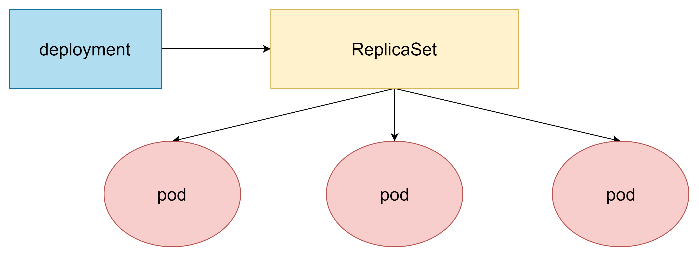

>  官方手册 https://kubernetes.io/zh-cn/docs/reference/kubectl/


# 1. 安装k8s集群

## 1.1通过kubeadm安装

kubeadm是官方社区推出的一个用于快速部署kubernetes集群的工具。

> 生产环境k8s集群建议使用二进制文件安装


### 1. 安装要求

在开始之前，部署Kubernetes集群机器需要满足以下几个条件：

- 一台或多台机器，操作系统 CentOS7.x-86_x64
- 硬件配置：2GB或更多RAM，2个CPU或更多CPU，硬盘30GB或更多
- 可以访问外网，需要拉取镜像，如果服务器不能上网，需要提前下载镜像并导入节点
- 禁止swap分区

### 2. 准备环境

| 角色   | IP           |
| ------ | ------------ |
| master | 192.168.1.11 |
| node1  | 192.168.1.12 |
| node2  | 192.168.1.13 |

```shell
# 关闭防火墙
systemctl stop firewalld
systemctl disable firewalld

# 关闭selinux
sed -i 's/enforcing/disabled/' /etc/selinux/config  # 永久
setenforce 0  # 临时

# 关闭swap
swapoff -a  # 临时
sed -ri 's/.*swap.*/#&/' /etc/fstab    # 永久

# 根据规划设置主机名
hostnamectl set-hostname <hostname>

# 在master添加hosts
cat >> /etc/hosts << EOF
192.168.44.146 k8smaster
192.168.44.145 k8snode1
192.168.44.144 k8snode2
EOF

# 将桥接的IPv4流量传递到iptables的链
cat > /etc/sysctl.d/k8s.conf << EOF
net.bridge.bridge-nf-call-ip6tables = 1
net.bridge.bridge-nf-call-iptables = 1
EOF
sysctl --system  # 生效

# 时间同步
yum install ntpdate -y
ntpdate time.windows.com
```

### 3. 所有节点安装Docker/kubeadm/kubelet

Kubernetes默认CRI（容器运行时）为Docker，因此先安装Docker。

#### 3.1 安装Docker

```shell
$ wget https://mirrors.aliyun.com/docker-ce/linux/centos/docker-ce.repo -O /etc/yum.repos.d/docker-ce.repo
$ yum -y install docker-ce-18.06.1.ce-3.el7
$ systemctl enable docker && systemctl start docker
$ docker --version
Docker version 18.06.1-ce, build e68fc7a
$ cat > /etc/docker/daemon.json << EOF
{
  "registry-mirrors": ["https://b9pmyelo.mirror.aliyuncs.com"]
}
EOF
```

#### 3.2 添加阿里云YUM软件源

```shell
$ cat > /etc/yum.repos.d/kubernetes.repo << EOF
[kubernetes]
name=Kubernetes
baseurl=https://mirrors.aliyun.com/kubernetes/yum/repos/kubernetes-el7-x86_64
enabled=1
gpgcheck=0
repo_gpgcheck=0
gpgkey=https://mirrors.aliyun.com/kubernetes/yum/doc/yum-key.gpg https://mirrors.aliyun.com/kubernetes/yum/doc/rpm-package-key.gpg
EOF
```

#### 3.3 安装kubeadm，kubelet和kubectl

由于版本更新频繁，这里指定版本号部署：

```shell
$ yum install -y kubelet-1.18.0 kubeadm-1.18.0 kubectl-1.18.0
$ systemctl enable kubelet
```

### 4. 部署Kubernetes Master

在192.168.31.61（Master）执行。

```shell
$ kubeadm init \
  --apiserver-advertise-address=192.168.44.146 \
  --image-repository registry.aliyuncs.com/google_containers \
  --kubernetes-version v1.18.0 \
  --service-cidr=10.96.0.0/12 \
  --pod-network-cidr=10.244.0.0/16
```

由于默认拉取镜像地址k8s.gcr.io国内无法访问，这里指定阿里云镜像仓库地址。

使用kubectl工具：

```shell
mkdir -p $HOME/.kube
sudo cp -i /etc/kubernetes/admin.conf $HOME/.kube/config
sudo chown $(id -u):$(id -g) $HOME/.kube/config
$ kubectl get nodes
```

### 5. 加入Kubernetes Node

在192.168.1.12/13（Node）执行。

向集群添加新节点，执行在kubeadm init输出的kubeadm join命令：

```shell
$ kubeadm join 192.168.1.11:6443 --token esce21.q6hetwm8si29qxwn \
    --discovery-token-ca-cert-hash sha256:00603a05805807501d7181c3d60b478788408cfe6cedefedb1f97569708be9c5
```

默认token有效期为24小时，当过期之后，该token就不可用了。这时就需要重新创建token，操作如下：

```shell
kubeadm token create --print-join-command
```

### 6. 部署CNI网络插件

```shell
wget https://raw.githubusercontent.com/coreos/flannel/master/Documentation/kube-flannel.yml
```

默认镜像地址无法访问，sed命令修改为docker hub镜像仓库。

```shell
kubectl apply -f https://raw.githubusercontent.com/coreos/flannel/master/Documentation/kube-flannel.yml

kubectl get pods -n kube-system
NAME                          READY   STATUS    RESTARTS   AGE
kube-flannel-ds-amd64-2pc95   1/1     Running   0          72s
```

### 7. 测试kubernetes集群

在Kubernetes集群中创建一个pod，验证是否正常运行：

```shell
$ kubectl create deployment nginx --image=nginx
$ kubectl expose deployment nginx --port=80 --type=NodePort
$ kubectl get pod,svc
```

访问地址：http://NodeIP:Port  


## 1.2 通过二进制文件安装


todo


## 2. yaml文件

k8s 集群中对资源管理和资源对象编排部署都可以通过声明样式(YAML)文件来解决，也就是可以把需要对资源对象操作编辑到 YAML 格式文件中，我们把这种文件叫做资源清单文件.


### 资源编排文件格式语法

以service.yaml 文件语法举例

```yaml
apiVersion: v1     # 指定api版本，此值必须在kubectl api-versions中 
kind: Service     # 指定创建资源的角色/类型 
metadata:     # 资源的元数据/属性
  name: demo     # 资源的名字，在同一个namespace中必须唯一
  namespace: default     # 部署在哪个namespace中。不指定时默认为default命名空间
  labels:         # 设定资源的标签
  - app: demo
  annotations:  # 自定义注解属性列表
  - name: string
spec:     # 资源规范字段
  type: ClusterIP     # service的类型，指定service的访问方式，默认ClusterIP。
      # ClusterIP类型：虚拟的服务ip地址，用于k8s集群内部的pod访问，在Node上kube-porxy通过设置的iptables规则进行转发
      # NodePort类型：使用宿主机端口，能够访问各个Node的外部客户端通过Node的IP和端口就能访问服务器
      # LoadBalancer类型：使用外部负载均衡器完成到服务器的负载分发，需要在spec.status.loadBalancer字段指定外部负载均衡服务器的IP，并同时定义nodePort和clusterIP用于公有云环境。
  clusterIP: string        #虚拟服务IP地址，当type=ClusterIP时，如不指定，则系统会自动进行分配，也可以手动指定。当type=loadBalancer，需要指定
  sessionAffinity: string    #是否支持session，可选值为ClietIP，默认值为空。ClientIP表示将同一个客户端(根据客户端IP地址决定)的访问请求都转发到同一个后端Pod
  ports:
    - port: 8080     # 服务监听的端口号
      targetPort: 8080     # 容器暴露的端口
      nodePort: int        # 当type=NodePort时，指定映射到物理机的端口号
      protocol: TCP     # 端口协议，支持TCP或UDP，默认TCP
      name: http     # 端口名称
  selector:     # 选择器。选择具有指定label标签的pod作为管理范围
    app: demo
status:    # 当type=LoadBalancer时，设置外部负载均衡的地址，用于公有云环境    
  loadBalancer:    # 外部负载均衡器    
    ingress:
      ip: string    # 外部负载均衡器的IP地址
      hostname: string    # 外部负载均衡器的主机名
```


- apiVersion, 使用的api版本, `kubectl api-versions`查看所有支持的版本
  
  只要记住6个常用的apiversion一般就够用了。

  - **v1**： Kubernetes API的稳定版本，包含很多核心对象：pod、service等。
  - **apps/v1**： 包含一些通用的应用层的api组合，如：Deployments, RollingUpdates, and ReplicaSets。
  - **batch/v1**： 包含与批处理和类似作业的任务相关的对象，如：job、cronjob。
  - **autoscaling/v1**： 允许根据不同的资源使用指标自动调整容器。
  - **networking.k8s.io/v1**： 用于Ingress。
  - **rbac.authorization.k8s.io/v1**：用于RBAC。
  - [kubernetes.io apiVersion详细说明](https://link.juejin.cn?target=https%3A%2F%2Fkubernetes.io%2Fdocs%2Freference%2Fusing-api%2F)

> k8s 1.6版本之前 apiVsersion：extensions/v1beta1, 1.6版本到1.9版本之间：apps/v1beta1, 1.9版本之后:apps/v1


- kind: 指定这个资源对象的类型，如 pod、deployment、statefulset、job、cronjob
- metadata: 资源的元数据
- spec: 资源的规格配置, 是重要/主要的配置项，支持的子项非常多，根据资源对象的不同，子项会有不同的配置。

- port
  - **port**：port是k8s集群**内部访问service的端口**，即通过clusterIP: port可以访问到某个service
  - nodePort**：nodePort是**外部访问k8s集群中service的端口**，通过nodeIP: nodePort可以从外部访问到某个service。**
  - targetPort**：targetPort是**pod的端口**，从port和nodePort来的流量经过kube-proxy流入到后端pod的targetPort上，最后进入容器。**
  - containerPort**：containerPort是**pod内部容器的端口**，targetPort映射到containerPort。


**一个pod的简要yaml：**

```yaml
apiVersion: v1 #必选，版本号，例如v1
kind: Pod #必选，Pod 
metadata: #必选，元数据 
  name: nginx #必选，Pod名称 
  labels: #自定义标签 
     app: nginx #自定义标签名字 
spec: #必选，Pod中容器的详细定义 
     containers: #必选，Pod中容器列表，一个pod里会有多个容器 
        - name: nginx #必选，容器名称 
          image: nginx #必选，容器的镜像名称 
          imagePullPolicy: IfNotPresent # [Always | Never | IfNotPresent] #获取镜像的策略 Alawys表示下载镜像 IfnotPresent表示优先使用本地镜像，否则下载镜像，Nerver表示仅使用本地镜像 
          ports: #需要暴露的端口库号列表 
          - containerPort: 80 #容器需要监听的端口号 
     restartPolicy: Always # [Always | Never | OnFailure]#Pod的重启策略，Always表示一旦不管以何种方式终止运行，kubelet都将重启，OnFailure表示只有Pod以非0退出码退出才重启，Nerver表示不再重启该Pod 
```

**一个ingress的yaml** 

```yaml
apiVersion: extensions/v1beta1         # 创建该对象所使用的 Kubernetes API 的版本     
kind: Ingress         # 想要创建的对象的类别，这里为Ingress
metadata:
  name: showdoc        # 资源名字，同一个namespace中必须唯一
  namespace: op     # 定义资源所在命名空间
  annotations:         # 自定义注解
    kubernetes.io/ingress.class: nginx        # 声明使用的ingress控制器
spec:
  rules:
  - host: showdoc.example.cn     # 服务的域名
    http:
      paths:
      - path: /      # 路由路径
        backend:     # 后端Service
          serviceName: showdoc        # 对应Service的名字
          servicePort: 80           # 对应Service的端口
```


### 获取yaml文件方式

1. 通过create命令来生成yaml文件,  `kubectl create deployment ng --image=nginx -o yaml --dry-run=client`
   - `-o yaml`打印过程yaml内容, 
   - `--dry-run=client`, 不会执行命令

```shell
[root@master ~]# kubectl create deployment ng1 --image=nginx -o yaml --dry-run=client
W0307 23:52:54.624253   95844 helpers.go:535] --dry-run is deprecated and can be replaced with --dry-run=client.
apiVersion: apps/v1
kind: Deployment
metadata:
  creationTimestamp: null
  labels:
    app: ng1
  name: ng1
spec:
  replicas: 1
  selector:
    matchLabels:
      app: ng1
  strategy: {}
  template:
    metadata:
      creationTimestamp: null
      labels:
        app: ng1
    spec:
      containers:
      - image: nginx
        name: nginx
        resources: {}
status: {}
```


2. 通过get命令导出运行中的资源的yaml文件

```shell
[root@master ~]# kubectl get deployments nginx -o=yaml
apiVersion: apps/v1
kind: Deployment
metadata:
  labels:
    app: nginx
spec:
  replicas: 1
  selector:
    matchLabels:
      app: nginx
  template:
    metadata:
      creationTimestamp: null
      labels:
        app: nginx
    spec:
      containers:
      - image: nginx
        imagePullPolicy: Always
        name: nginx
        resources: {}
        terminationMessagePath: /dev/termination-log
        terminationMessagePolicy: File
      dnsPolicy: ClusterFirst
      restartPolicy: Always
      schedulerName: default-scheduler
      securityContext: {}
      terminationGracePeriodSeconds: 30
....
```


3. `explain`查看yaml的所有字段、默认值和示例的详细信息,

我现在要知道deployment对象的spec属性的还有哪些可用的字段。

```shell
[root@master ~]# kubectl explain deployment.spec
KIND:     Deployment
VERSION:  apps/v1

RESOURCE: spec <Object>

DESCRIPTION:
     Specification of the desired behavior of the Deployment.

     DeploymentSpec is the specification of the desired behavior of the
     Deployment.

FIELDS:
   minReadySeconds      <integer>
     Minimum number of seconds for which a newly created pod should be ready
     without any of its container crashing, for it to be considered available.
     Defaults to 0 (pod will be considered available as soon as it is ready)

   paused       <boolean>
     Indicates that the deployment is paused.

   progressDeadlineSeconds      <integer>
     The maximum time in seconds for a deployment to make progress before it is
     considered to be failed. The deployment controller will continue to process
     failed deployments and a condition with a ProgressDeadlineExceeded reason
     will be surfaced in the deployment status. Note that progress will not be
     estimated during the time a deployment is paused. Defaults to 600s.

   replicas     <integer>
     Number of desired pods. This is a pointer to distinguish between explicit
     zero and not specified. Defaults to 1.

   revisionHistoryLimit <integer>
     The number of old ReplicaSets to retain to allow rollback. This is a
     pointer to distinguish between explicit zero and not specified. Defaults to
     10.

   selector     <Object> -required-
     Label selector for pods. Existing ReplicaSets whose pods are selected by
     this will be the ones affected by this deployment. It must match the pod
     template's labels.

   strategy     <Object>
     The deployment strategy to use to replace existing pods with new ones.

   template     <Object> -required-
     Template describes the pods that will be created.
```


### yaml格式校验

`--dry-run=client`模式可以校验yaml是否有问题

`kubectl create -f pod_liveness_test.yaml --dry-run=client`


也可以使用外部工具kubeval

> https://www.kubeval.com/


# 2. kubernetes 集群命令行工具 kubectl

kubectl 是 Kubernetes 集群的命令行工具，通过 kubectl 能够对集群本身进行管理，并能 够在集群上进行容器化应用的安装部署。

kubectl 命令的语法

```shell
kubectl [command] [TYPE] [NAME] [flags]
```

其中 `command`、`TYPE`、`NAME` 和 `flags` 分别是：

- `command`：指定要对一个或多个资源执行的操作，例如 `create`、`get`、`describe`、`delete`。

- `TYPE`：指定资源类型。资源类型不区分大小写， 可以指定单数、复数或缩写形式。例如，以下命令输出相同的结果：

  ```shell
  kubectl get pod pod1
  kubectl get pods pod1
  kubectl get po pod1
  ```

- `NAME`：指定资源的名称。名称区分大小写。 如果省略名称，则显示所有资源的详细信息。例如：`kubectl get pods`。

  在对多个资源执行操作时，你可以按类型和名称指定每个资源，或指定一个或多个文件：

  - 要按类型和名称指定资源：

  - 要对所有类型相同的资源进行分组，请执行以下操作：`TYPE1 name1 name2 name<#>`。
    例子：`kubectl get pod example-pod1 example-pod2`

  - 分别指定多个资源类型：`TYPE1/name1 TYPE1/name2 TYPE2/name3 TYPE<#>/name<#>`。
    例子：`kubectl get pod/example-pod1 replicationcontroller/example-rc1`

  - 用一个或多个文件指定资源：`-f file1 -f file2 -f file<#>`

  - 使用 YAML 而不是 JSON， 因为 YAML 对用户更友好, 特别是对于配置文件。
    例子：`kubectl get -f ./pod.yaml`

- `flags`： 指定可选的参数。例如，可以使用 `-s` 或 `--server` 参数指定 Kubernetes API 服务器的地址和端口。

- `kubectl --help` 查看详细说明


# 3. Pod

## 常用命令

```shell
# 创建pod
kubectl create -f pod_name.yaml

# 查看pod
kubectl get pod <Pod_name>
kubectl get pod <Pod_name> -o wide 
kubectl describe pod <Pod_name>

# 删除pod
kubectl delete -f pod pod_name.yaml
kubectl delete pod --all/[pod_name]

# 如果pod一直没起来, describe命令查看详情
kubectl describe pod [pod_name]
```


## Pod.yaml详细说明

```yaml
apiVersion: v1     #必选，版本号，例如v1
kind: Pod       　 #必选，资源类型，例如 Pod,Deployment,ReplicaSet,Replication
metadata:       　 #必选，元数据
  name: string     #必选，Pod名称
  namespace: string  #Pod所属的命名空间,默认为"default"
  labels:       　　  #自定义标签列表
    - name: string      　          
spec:  #必选，Pod中容器的详细定义
  containers:  #必选，Pod中容器列表
  - name: string   #必选，容器名称
    image: string  #必选，容器的镜像名称
    imagePullPolicy: [ Always|Never|IfNotPresent ]  #获取镜像的策略 
    command: [string]   #容器的启动命令列表，如不指定，使用打包时使用的启动命令
    args: [string]      #容器的启动命令参数列表
    workingDir: string  #容器的工作目录
    volumeMounts:       #挂载到容器内部的存储卷配置
    - name: string      #引用pod定义的共享存储卷的名称，需用volumes[]部分定义的的卷名
      mountPath: string #存储卷在容器内mount的绝对路径，应少于512字符
      readOnly: boolean #是否为只读模式
	
	  volumes:   #在该pod上定义共享存储卷列表
	  - name: string    #共享存储卷名称 （volumes类型有很多种）
    emptyDir: {}       #类型为emtyDir的存储卷，与Pod同生命周期的一个临时目录。为空值
    hostPath: string   #类型为hostPath的存储卷，表示挂载Pod所在宿主机的目录
      path: string      　　        #Pod所在宿主机的目录，将被用于同期中mount的目录
    secret:       　　　#类型为secret的存储卷，挂载集群与定义的secret对象到容器内部
      scretname: string  
      items:     
      - key: string
        path: string
    configMap:         #类型为configMap的存储卷，挂载预定义的configMap对象到容器内部
      name: string
      items:
      - key: string
        path: string
	  
    ports: #需要暴露的端口库号列表
    - name: string        #端口的名称
      containerPort: int  #容器需要监听的端口号
      hostPort: int       #容器所在主机需要监听的端口号，默认与Container相同
      protocol: string    #端口协议，支持TCP和UDP，默认TCP
	  
    env:   #容器运行前需设置的环境变量列表
    - name: string  #环境变量名称
      value: string #环境变量的值
	  
    resources: #资源限制和请求的设置
      limits:  #资源限制的设置
        cpu: string     #cpu的限制，单位为core数，将用于docker run --cpu-shares参数
        memory: string  #内存限制，单位可以为Mib/Gib，将用于docker run --memory参数
      requests: #资源请求的设置
        cpu: string    #cpu请求，容器启动的初始可用数量
        memory: string #内存请求,容器启动的初始可用数量
		
    lifecycle: #生命周期钩子
		postStart: #容器启动后立即执行此钩子,如果执行失败,会根据重启策略进行重启
		preStop: #容器终止前执行此钩子,无论结果如何,容器都会终止
		
    livenessProbe:  #对Pod内各容器健康检查的设置，当探测无响应几次后将自动重启该容器
      exec:       　 #对Pod容器内检查方式设置为exec方式
        command: [string]  #exec方式需要制定的命令或脚本
      initialDelaySeconds:  <integer>  # 容器启动后等待多少秒执行第一次探测
      timeoutSeconds:       <integer>  # 探测超时时间。默认1秒，最小1秒
	    periodSeconds:        <integer>  # 执行探测的频率。默认是10秒，最小1秒
	    failureThreshold:     <integer>  # 连续探测失败多少次才被认定为失败。默认是3。最小值是1
	    successThreshold:     <integer>  # 连续探测成功多少次才被认定为成功。默认是1			
      
      httpGet:       #对Pod内个容器健康检查方法设置为HttpGet，需要制定Path、port
        path: string
        port: number
        host: string
        scheme: string
        HttpHeaders:
        - name: string
          value: string
		
      tcpSocket:     #对Pod内个容器健康检查方式设置为tcpSocket方式
         port: number
       initialDelaySeconds: 0       #容器启动完成后首次探测的时间，单位为秒
       timeoutSeconds: 0    　　    #对容器健康检查探测等待响应的超时时间，单位秒，默认1秒
       periodSeconds: 0     　　    #对容器监控检查的定期探测时间设置，单位秒，默认10秒一次
       successThreshold: 0
       failureThreshold: 0
       securityContext:
         privileged: false
  restartPolicy: [Always | Never | OnFailure]  #Pod的重启策略
  nodeName: <string> #设置NodeName表示将该Pod调度到指定到名称的node节点上
  nodeSelector: obeject #设置NodeSelector表示将该Pod调度到包含这个label的node上
  imagePullSecrets: #Pull镜像时使用的secret名称，以key：secretkey格式指定
  - name: string
  hostNetwork: false   #是否使用主机网络模式，默认为false，如果设置为true，表示使用宿主机网络
```


## 生命周期

> https://kubernetes.io/zh-cn/docs/concepts/workloads/pods/pod-lifecycle/

od 遵循预定义的生命周期，起始于 `Pending` 阶段， 如果至少其中有一个主要容器正常启动，则进入 `Running`，之后取决于 Pod 中是否有容器以失败状态结束而进入 `Succeeded` 或者 `Failed` 阶段。

| 生命周期状态        | 描述                                                         |
| :------------------ | :----------------------------------------------------------- |
| `Pending`（悬决）   | Pod 已被 Kubernetes 系统接受的初始状态，但有一个或者多个容器尚未创建亦未运行。此阶段包括等待 Pod 被调度的时间和通过网络下载镜像的时间。 |
| `Running`（运行中） | Pod 已经绑定到了某个Node，Pod 中所有的容器都已被创建。至少有一个容器仍在运行，或者正处于启动或重启状态。 |
| `Succeeded`（成功） | Pod 中的所有容器都已成功终止，并且不会再重启。               |
| `Failed`（失败）    | Pod 中的所有容器都已终止，并且至少有一个容器是因为失败终止。也就是说，容器以非 0 状态退出或者被系统终止。 |
| `Unknown`（未知）   | 因为某些原因无法取得 Pod 的状态。这种情况通常是因为与 Pod 所在主机通信失败。 |

## 重启策略

```yaml
spec:  
  containers: 
  ...
  restartPolicy: [Always | OnFailure | Never]  #Pod的重启策略
```

**Always**：只要容器异常退出，kubelet就会自动重启该容器。（这个是默认的重启策略）
**OnFailure**：当容器终止运行且退出码不为0时，由kubelet自动重启该容器。
**Never**：不论容器运行状态如何，kubelet都不会重启该容器。


## 资源配置

```yaml
spec:  
  containers: 
  - name: string  
    image: string  
    resources: 
      limits:  # 最大资源
        cpu: 250m   # 一个CPU分为1000份(1000m), 250m等效于0.25个cpu资源    
        memory: 128Mi 
      requests:  # 最小资源
        cpu: 1000m  
        memory: 1024Mi 
```


## 健康检查探针

`livenessProbe`存活检查失败, 将杀死容器, 再根据Pod的`restartPolicy`来执行.

`readinessProbe`就绪检查失败, k8s会将pod从service endpoint中剔除, 不再将任何请求调度此 Pod 上，直到下次探测成功.

|          | livenessProbe存活探针 | readinessProbe就绪探针 |
| -------- | --------------------- | ---------------------- |
| 用途     | 判断pod是否存活       | 判断pod是否就绪        |
| 检测器   | pod运行期             | pod启动器              |
| 失败处理 | kill容器              | 停止向pod发送流量      |


三种探针检查方式:  

- exec, 执行shell命令, 返回状态码0则为成功
- httpGet, 发送http请求, 返回状态码200-400之间为成功
- tcpSocket,  tcp连接建立为成功


完整配置

```yaml
spec:  
  containers: 
  - name: string  
    image: string  
    livenessProbe:  #对Pod内各容器健康检查的设置，当探测无响应几次后将自动重启该容器
      exec:       　 #对Pod容器内检查方式设置为exec方式
        command: [string]  #exec方式需要制定的命令或脚本
      initialDelaySeconds:  <integer>  # 容器启动后等待多少秒执行第一次探测
      timeoutSeconds:       <integer>  # 探测超时时间。默认1秒，最小1秒
	    periodSeconds:        <integer>  # 执行探测的频率。默认是10秒，最小1秒
	    failureThreshold:     <integer>  # 连续探测失败多少次才被认定为失败。默认是3。最小值是1
	    successThreshold:     <integer>  # 连续探测成功多少次才被认定为成功。默认是1			
      
      httpGet:       #对Pod内个容器健康检查方法设置为HttpGet，需要制定Path、port
        path: string
        port: number
        host: string
        scheme: string
        HttpHeaders:
        - name: string
          value: string
		
      tcpSocket:     #对Pod内个容器健康检查方式设置为tcpSocket方式
         port: number
       initialDelaySeconds: 0       #容器启动完成后首次探测的时间，单位为秒
       timeoutSeconds: 0    　　    #对容器健康检查探测等待响应的超时时间，单位秒，默认1秒
       periodSeconds: 0     　　    #对容器监控检查的定期探测时间设置，单位秒，默认10秒一次
       successThreshold: 0
       failureThreshold: 0
       securityContext:
         privileged: false
```


livenessProbe存活探针检测`pod_liveness_test.yaml`

```yaml
apiVersion: v1
kind: Pod
metadata:
  name: liveness-test
  namespace: default
spec:
  containers:
    - name: liveness-test
      image: busybox:latest
      imagePullPolicy: IfNotPresent
      command: 
        - /bin/sh
      args:
        - -c
        - touch /tmp/healthy; sleep 60; rm -rf /tmp/healthy; sleep 60
      resources:
        limits:
          cpu: 500m
          memory: 128Mi
        requests:
          cpu: 250m
          memory: 64Mi
      livenessProbe:
        exec:
          command:
            - test
            - /tmp/healthy
        initialDelaySeconds: 5
        timeoutSeconds: 5
        periodSeconds: 5
        failureThreshold: 3
        successThreshold: 1
  restartPolicy: Always
  hostNetwork: false
```


## 调度策略

影响调度的因素

- 资源配置
容器不会分配到不满足容器资源需求的node

```yaml
    resources: #资源限制和请求的设置
      limits:  #资源限制的设置
        cpu: string     #cpu的限制，单位为core数，将用于docker run --cpu-shares参数
        memory: string  #内存限制，单位可以为Mib/Gib，将用于docker run --memory参数
      requests: #资源请求的设置
        cpu: string    #cpu请求，容器启动的初始可用数量
        memory: string #内存请求,容器启动的初始可用数量
```

- 定向调度：NodeName、NodeSelector、label

NodeName用于指定资源分配到指定node上,  

标签Label是用户自定义key-value对，用于对资源分组,  和NodeSelector配合调度


对node加label

```shell
[root@master k8s]# kubectl label node node1 node_env=dev
node/node1 labeled
[root@master k8s]# kubectl describe node node1
Name:               node1
Roles:              <none>
Labels:             beta.kubernetes.io/arch=amd64
                    beta.kubernetes.io/os=linux
                    kubernetes.io/arch=amd64
                    kubernetes.io/hostname=node1
                    kubernetes.io/os=linux
                    node_env=dev  # 新加的
```

创建pod的yaml, 指定nodeSelector

```yaml
spec:
  ...
  nodeName: nodexxx #设该Pod调度到nodexxx节点上
  nodeSelector:  #设置NodeSelector表示将该Pod调度到包含这个label的node上
    node_env: dev 
```


- 亲和调度

  // todo

  

- 污点taint和容忍度tolerations

  这是node端的属性

// todo


# 4. Deployment

Deployment 通过 Replication Set 管理 Pod ，基于Label selector实现对pod自动进行创建、补足、替换、删除、动态缩放等功能. Deployment适合部署无状态应用.




```yaml
apiVersion: apps/v1  #版本号
kind: Deployment  #类型
metadata:    #元数据
  name:    #rs名称
  namespace:   #所属命名空间
  labels:   #标签
    controller: deploy
spec:   #详情描述
  replicas:  #副本数量
  revisionHistoryLimit: #保留历史版本，默认是10
  paused: #暂停部署，默认是false
  progressDeadlineSeconds: #部署超时时间(s)，默认是600
  strategy: #策略
    type: RollingUpdates  #滚动更新策略
    rollingUpdate:  #滚动更新
      maxSurge: #最大额外可以存在的副本数，可以为百分比，也可以为整数
      maxUnavaliable: #最大不可用状态的pod的最大值，可以为百分比，也可以为整数
  selector:  #选择器，通过它指定该控制器管理哪些pod
    matchLabels:   #Labels匹配规则
       app: nginx-pod
    matchExpressions:   #Expression匹配规则
      - {key: app, operator: In, values: [nginx-pod]}
  template:  #模板，当副本数量不足时，会根据下面的模板创建pod副本
    metadata:
        labels:
          app: nginx-pod  # 与selector.matchLabels一致才会被对应的deployment管理
    spec:
      containers:
      - name: nginx
        image: nginx:1.17.1
        ports:
        - containerPort: 80
```


## 通过label匹配来管理pod

deployment通过`selector.matchLabels`来匹配管理哪些pod

```yaml
spec:   #详情描述
 	... 
  selector:  #选择器，通过它指定该控制器管理哪些pod
    matchLabels:   #Labels匹配规则
       app: nginx-pod
```

pod的`metadata.labels`和deployment的`selector.matchLabels`一致才会被匹配到

```yaml
apiVersion: v1     
kind: Pod       　
metadata:       　
  ...
  labels:       　　  
    - app: nginx-pod       
```


## 应用升级回滚

### 升级

**命令**

`kubectl set image 资源类型1,资源类型2 容器名=镜像名:镜像版本  `

`kubectl set image -f xxx.yaml 容器名=镜像名:镜像版本  `

查看升级状态

```shell
[root@master k8s]# kubectl rollout status deployment.apps/ng
deployment "ng" successfully rolled out
```


**升级试验**

```shell
[root@master k8s]# kubectl describe deployment ng
Name:                   ng
Namespace:              default
...
Pod Template:
  Labels:  app=ng
  Containers:
   nginx:
    Image:        nginx:latest  # 目前镜像版本
...
[root@master k8s]# kubectl set image deployment ng nginx=nginx:1.15 # 升级命令
deployment.apps/ng image updated
[root@master ~]# kubectl get all
NAME                      READY   STATUS              RESTARTS   AGE
pod/ng-765fdfbc59-q2mm2   0/1     ContainerCreating   0          34s    # 正常创建新pod
pod/ng-78c956fd57-tdkcr   1/1     Running             0          2m12s

NAME                 TYPE        CLUSTER-IP   EXTERNAL-IP   PORT(S)   AGE
service/kubernetes   ClusterIP   10.96.0.1    <none>        443/TCP   10d

NAME                 READY   UP-TO-DATE   AVAILABLE   AGE
deployment.apps/ng   1/1     1            1           7m26s

NAME                            DESIRED   CURRENT   READY   AGE
replicaset.apps/ng-765fdfbc59   1         1         0       7m26s
replicaset.apps/ng-78c956fd57   1         1         1       2m12s
[root@master k8s]# kubectl rollout status deployment ng   # 检查升级状态
Waiting for deployment "ng" rollout to finish: 1 old replicas are pending termination...
Waiting for deployment "ng" rollout to finish: 1 old replicas are pending termination...
deployment "ng" successfully rolled out
[root@master k8s]# kubectl describe deployment ng                      
Name:                   ng
Namespace:              default
CreationTimestamp:      Sat, 16 Mar 2024 17:38:27 +0800
Labels:                 app=ng
Annotations:            deployment.kubernetes.io/revision: 2
Selector:               app=ng
Replicas:               1 desired | 1 updated | 2 total | 1 available | 1 unavailable
StrategyType:           RollingUpdate
MinReadySeconds:        0
RollingUpdateStrategy:  25% max unavailable, 25% max surge
Pod Template:
  Labels:  app=ng
  Containers:
   nginx:
    Image:        nginx:1.15  # 镜像更新为nginx 1.15
    ...
```


### 回滚

```shell
[root@master k8s]# kubectl rollout undo deployment ng      # 回滚上一个版本
deployment.apps/ng rolled back
[root@master k8s]# kubectl rollout status deployment ng 	# 检查升级状态
Waiting for deployment "ng" rollout to finish: 1 old replicas are pending termination...
Waiting for deployment "ng" rollout to finish: 1 old replicas are pending termination...
deployment "ng" successfully rolled out

[root@master k8s]# kubectl rollout history deployment ng  # 查看升级版本
deployment.apps/ng 
REVISION  CHANGE-CAUSE
3         <none>
4         <none>
[root@master k8s]# kubectl rollout undo deployment ng --to-revision=3 # 回滚到指定版本
```


## 水平扩缩(Horizontal Pod Autoscal)

Horizontal Pod Autoscal(Pod 横向扩容 简称 HPA)属于一种 **Kubernetes 资源对象**。通过追踪分析 replication set 控制的所有目标 Pod 的负载变化情况，来确定是 否需要针对性地调整目标 Pod 的副本数，这是 HPA 的 实现原理。

Kubernetes 对 Pod 扩容与缩容提供了手动和自动两种模式，手动模式通过 kubectl scale 命令对一个 Deployment/RC 进行 Pod 副本数量的设置。自动模式则需要用户根据某个性能 指标或者自定义业务指标，并指定 Pod 副本数量的范围，系统将自动在这个范围内根据性 能指标的变化进行调整。


**手动水平扩缩**

```shell
[root@master k8s]# kubectl scale deployment ng --replicas=3
deployment.apps/ng scaled
[root@master ~]# kubectl get pod && kubectl get deployment
NAME                  READY   STATUS              RESTARTS   AGE
ng-78c956fd57-lff47   0/1     ContainerCreating   0          42s
ng-78c956fd57-n2nzk   1/1     Running             0          12m
ng-78c956fd57-sf6f4   0/1     ContainerCreating   0          42s
NAME   READY   UP-TO-DATE   AVAILABLE   AGE
ng     1/3     3            1           23m
[root@master ~]# kubectl get pod &&  kubectl get deployment
NAME                  READY   STATUS    RESTARTS   AGE
ng-78c956fd57-lff47   1/1     Running   0          104s
ng-78c956fd57-n2nzk   1/1     Running   0          13m
ng-78c956fd57-sf6f4   1/1     Running   0          104s
NAME   READY   UP-TO-DATE   AVAILABLE   AGE
ng     3/3     3            3           25m
```


**自动水平扩缩**

HPA要求k8s服务器版本1.23+, 并且在集群中安装 [Metrics Server](https://github.com/kubernetes-sigs/metrics-server)， HPA 才能正常工作。

HPA 控制器基于`Master`的`kube-controller-manager`服务启动参数`--horizontal-pod- autoscaler-sync-period`定义的时长(默认值为 30s), 周期性地监测 Pod 的 CPU 使用率，并在满足条件时对 RC 或 Deployment 中的Pod副本数量进行调整.

详见: HPA演练 https://kubernetes.io/zh-cn/docs/tasks/run-application/horizontal-pod-autoscale-walkthrough/


## 垂直扩缩VPA (vertical autoscaler)

水平扩缩是通过调整pod数量来支持更高的负载需求, 而垂直扩缩是通过分配硬件资源（内存或 CPU）给Pod.  

VPA 并非默认来源于 Kubernetes，而是一个独立的项目， 参见 [on GitHub](https://github.com/kubernetes/autoscaler/tree/9f87b78df0f1d6e142234bb32e8acbd71295585a/vertical-pod-autoscaler)。

安装后，你可以为工作负载创建 [CustomResourceDefinitions](https://kubernetes.io/zh-cn/docs/tasks/extend-kubernetes/custom-resources/custom-resource-definitions/)(CRDs)， 定义**如何**以及**何时**扩缩被管理副本的资源。


# 5. service

**Service**为一组具有相同功能的容器应用提供一个统一的入口地址，并且将请求负载分发到后端的各个容器应用上。

**service**也是通过Label Selector来匹配pod. 

## 类型

- ClusterIP(默认): 应用集群内部访问

- NodePort: 应用对外访问

- LoadBalancer: 应用对外访问, 适用共有云

- ExternalName: 将service服务映射到 DNS 名称


### ClusterIP

ClusterIP的Service yaml如下：

```yaml
apiVersion: v1
kind: Service
metadata:
  name: cluster-service-ng
spec:
  type: ClusterIP
  ports:
  - port: 3000
    protocol: TCP
    targetPort: 443
  selector:
    app: ng
```

创建一个类型为ClusterIP的服务, 监听3000端口, 把请求转发到pod的443端口.

ClusterIP类型的service只能在集群内访问。

```shell
[root@master k8s]# kubectl get service/cluster-service-ng        
NAME                 TYPE        CLUSTER-IP      EXTERNAL-IP   PORT(S)    AGE
cluster-service-ng   ClusterIP   10.104.68.246   <none>        3000/TCP   28s
```


### NodePort

NodePort 类型service.yaml 如下：

```yaml
apiVersion: v1
kind: Service
metadata:
  name: nodeport-service-ng
spec:
  type: NodePort
  ports:
  - port: 3000
    protocol: TCP
    targetPort: 443
    nodePort: 30080
  selector:
    app: ng
```


```shell
[root@master k8s]# kubectl get service/nodeport-service-ng -o wide
NAME                  TYPE       CLUSTER-IP     EXTERNAL-IP   PORT(S)          AGE   SELECTOR
nodeport-service-ng   NodePort   10.99.237.10   <none>        3000:32416/TCP   22s   app=ng
```

k8s集群外部可以通过`32416`端口访问到指定匹配到的pod. NodePort对外端口通过`--service-node-port-range`配置端口范围,  默认是`30000-32767`。


### LoadBalancer

LoadBalancer类型的service 是可以实现集群外部访问服务的另外一种解决方案, 但大多是在公有云托管集群中会支持该类型。

LoadBalancer service 的yaml 如下：

```yaml
apiVersion: v1
kind: Service
metadata:
  name: loadBalance-service-ng
spec:
  type: LoadBalancer
  ports:
  - port: 3000
    protocol: TCP
    targetPort: 443
    nodePort: 30080
  selector:
    app: ng
```


```shell
[root@master k8s]# kubectl get svc loadbalance-service-ng
NAME                     TYPE           CLUSTER-IP      EXTERNAL-IP   PORT(S)          AGE
loadbalance-service-ng   LoadBalancer   10.111.56.162   <pending>     3000:30080/TCP   14m
```

k8s集群外可以通过`<EXTERNAL-IP>:30080`来访问.

EXTERNAL-IP是<pending>的原因后续补 // todo


**service的负载分发策略**

- RoundRobin：轮询模式(默认)，即轮询将请求转发到后端的各个Pod上     
- SessionAffinity：基于客户端IP地址进行会话保持的模式，第一次客户端访问后端某个Pod，之后的请求都转发到这个Pod上


### ExternalName

 ExternalName 的service将服务映射到 DNS 名称, 可以使用`spec.externalName`参数指定这些服务。

ExternalName 类型的服务的 yaml 如下：

```yaml
apiVersion: v1
kind: Service
metadata:
  name: extname-service
  namespace: test-namespace
spec:
  type: ExternalName
  externalName: my.database.example.com # CNAME记录
```

以上Service 定义将 `test-namespace` 名字空间中的 `extname-service` 服务映射到 `my.database.example.com`, 当查找主机 `extname-service.test-namespace.svc.cluster.local` 时，集群 DNS 服务返回 `CNAME` 记录， 其值为 `my.database.example.com`。

访问 `extname-service` 的方式与访问其他 Service 的方式相同， 主要区别在于重定向发生在 DNS 级别，而不是通过代理或转发来完成。 如果后来你决定将数据库移到集群中，则可以启动其 Pod，添加适当的选择算符或端点并更改 Service 的 `type`。


## Headless 无头服务

`headless`无头服务是`ClusterIP`类型服务的特殊情况.  `ClusterIP`可以为后端的`pod`提供虚拟ip和负载均衡代理以供访问. 

如下代码, `CLUSTER-IP`列就是虚拟ip

```shell
[root@master ~]# kubectl get svc
NAME                  TYPE        CLUSTER-IP      EXTERNAL-IP   PORT(S)        AGE
cluster-service-ng    ClusterIP   10.107.183.54   <none>        80/TCP         3d5h
kubernetes            ClusterIP   10.96.0.1       <none>        443/TCP        14d
nodeport-service-ng   NodePort    10.110.150.54   <none>        80:31152/TCP   3d5h
```

如果不需要负债均衡的代理功能, 可以把`spec.clusterIP`的值设为 `"None"` 来创建无头服务(Headless Service).

```yaml
apiVersion: v1
kind: Service
metadata:
  name: cluster-service-ng
spec:
  type: ClusterIP   # 默认ClusterIP
  clusterIP: None   # 指定None, 创建无头服务
  ports:
  - port: 80
    protocol: TCP
    targetPort: 80
  selector:
    app: ng
```


 headless服务是为pod提供一个固定的地址


# 6. StatefulSet

`deployment`适用部署无状态应用, 而`StatefulSet`是在`Deployment`的基础上扩展出来的控制器, 用于部署有状态应用:

- 持久存储
- 持久网络标识符（即使重启或者重新调度后也不会变）
- 有序的的部署, 扩缩, 滚动更新

每个由`StatefulSet`创建出来的`Pod`都拥有一个序号（从0开始）和一个固定的网络标识。可以在`YAML`定义中添加**VolumeClaimTemplate**来声明Pod存储使用的`PVC`。当`StatefulSet`部署`Pod`时，会从编号0到最终编号逐一部署每个`Pod`，只有前一个`Pod`部署完成并处于运行状态后，下一个`Pod`才会开始部署。

`StatefulSet`的核心功能，就是通过某种方式记录这些状态，然后在 `Pod` 被重新创建时，能够为新` Pod` 恢复这些状态。

`StatefulSet`把有状态应用**需要保持的状态**抽象分为了两种情况：

- **拓扑状态**。即应用的多个实例之间不是完全对等的关系。这些应用实例，必须按照某些顺序启动，如果把Pod 删除掉，它们再次被创建出来时也必须严格按照这个顺序才行。并且，新创建出来的 Pod，必须和原来 Pod 的网络标识一样，这样原先的访问者才能使用同样的方法，访问到这个新 Pod。
- **存储状态**。即应用的多个实例分别绑定了不同的存储数据。对于这些应用实例来说，Pod A 第一次读取到的数据，和Pod A 被重新创建后再次读取到的数据，应该是同一份 。这种情况最典型的例子，就是一个数据库应用的多个存储实例。


# 附录


## 资源缩写

```shell
[root@master ~]# kubectl api-resources 
NAME                              SHORTNAMES   APIGROUP                       NAMESPACED   KIND
bindings                                                                      true         Binding
componentstatuses                 cs                                          false        ComponentStatus
configmaps                        cm                                          true         ConfigMap
endpoints                         ep                                          true         Endpoints
events                            ev                                          true         Event
limitranges                       limits                                      true         LimitRange
namespaces                        ns                                          false        Namespace
nodes                             no                                          false        Node
persistentvolumeclaims            pvc                                         true         PersistentVolumeClaim
persistentvolumes                 pv                                          false        PersistentVolume
pods                              po                                          true         Pod
podtemplates                                                                  true         PodTemplate
replicationcontrollers            rc                                          true         ReplicationController
resourcequotas                    quota                                       true         ResourceQuota
secrets                                                                       true         Secret
serviceaccounts                   sa                                          true         ServiceAccount
services                          svc                                         true         Service
mutatingwebhookconfigurations                  admissionregistration.k8s.io   false        MutatingWebhookConfiguration
validatingwebhookconfigurations                admissionregistration.k8s.io   false        ValidatingWebhookConfiguration
customresourcedefinitions         crd,crds     apiextensions.k8s.io           false        CustomResourceDefinition
apiservices                                    apiregistration.k8s.io         false        APIService
controllerrevisions                            apps                           true         ControllerRevision
daemonsets                        ds           apps                           true         DaemonSet
deployments                       deploy       apps                           true         Deployment
replicasets                       rs           apps                           true         ReplicaSet
statefulsets                      sts          apps                           true         StatefulSet
tokenreviews                                   authentication.k8s.io          false        TokenReview
localsubjectaccessreviews                      authorization.k8s.io           true         LocalSubjectAccessReview
selfsubjectaccessreviews                       authorization.k8s.io           false        SelfSubjectAccessReview
selfsubjectrulesreviews                        authorization.k8s.io           false        SelfSubjectRulesReview
subjectaccessreviews                           authorization.k8s.io           false        SubjectAccessReview
horizontalpodautoscalers          hpa          autoscaling                    true         HorizontalPodAutoscaler
cronjobs                          cj           batch                          true         CronJob
jobs                                           batch                          true         Job
certificatesigningrequests        csr          certificates.k8s.io            false        CertificateSigningRequest
leases                                         coordination.k8s.io            true         Lease
endpointslices                                 discovery.k8s.io               true         EndpointSlice
events                            ev           events.k8s.io                  true         Event
ingresses                         ing          extensions                     true         Ingress
ingressclasses                                 networking.k8s.io              false        IngressClass
ingresses                         ing          networking.k8s.io              true         Ingress
networkpolicies                   netpol       networking.k8s.io              true         NetworkPolicy
runtimeclasses                                 node.k8s.io                    false        RuntimeClass
poddisruptionbudgets              pdb          policy                         true         PodDisruptionBudget
podsecuritypolicies               psp          policy                         false        PodSecurityPolicy
clusterrolebindings                            rbac.authorization.k8s.io      false        ClusterRoleBinding
clusterroles                                   rbac.authorization.k8s.io      false        ClusterRole
rolebindings                                   rbac.authorization.k8s.io      true         RoleBinding
roles                                          rbac.authorization.k8s.io      true         Role
priorityclasses                   pc           scheduling.k8s.io              false        PriorityClass
csidrivers                                     storage.k8s.io                 false        CSIDriver
csinodes                                       storage.k8s.io                 false        CSINode
storageclasses                    sc           storage.k8s.io                 false        StorageClass
volumeattachments                              storage.k8s.io                 false        VolumeAttachment
```


## 设置命令函自动补齐

```shell
yum install -y bash-completion -y

chmod +x /usr/share/bash-completion/bash_completion
/usr/share/bash-completion/bash_completion
source /usr/share/bash-completion/bash_completion
source <(kubectl completion bash)
```

这时补全已经可以用了， kubectl desc<tab> . 但必须使用kubectl的全称，使用别名不行。
设置登录自动加载：

```shell
echo "source <(kubectl completion bash)" >> /etc/bashrc
```


## 搭建本地k8s环境

## minikube搭建一个单节点的kubernetes集群环境


国内

```shell
minikube start --image-mirror-country='cn' --registry-mirror=https://registry.docker-cn.com  --image-repository registry.cn-hangzhou.aliyuncs.com/google_containers

minikube dashboard
```


## Multipass和k3s来搭建一个多节点的kubernetes集群环境

k3s 是一个轻量级的Kubernetes发行版，它是 Rancher Labs 推出的一个开源项目，

旨在简化Kubernetes的安装和维护，同时它还是CNCF认证的Kubernetes发行版。


## 在线实验环境 

Killercoda: https://killercoda.com/playgrounds/scenario/kubernetes
Play-With-K8s: https://labs.play-with-k8s.com/

